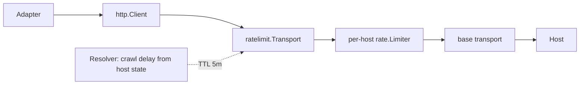
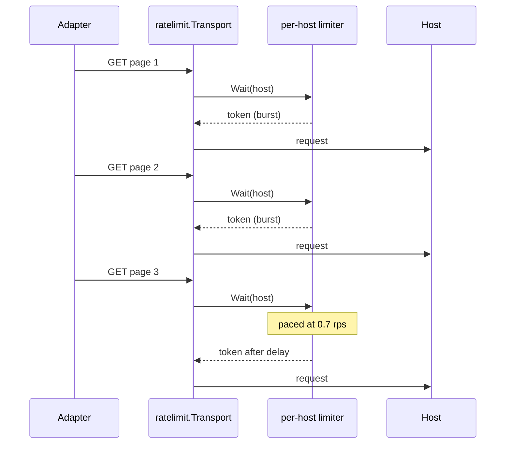
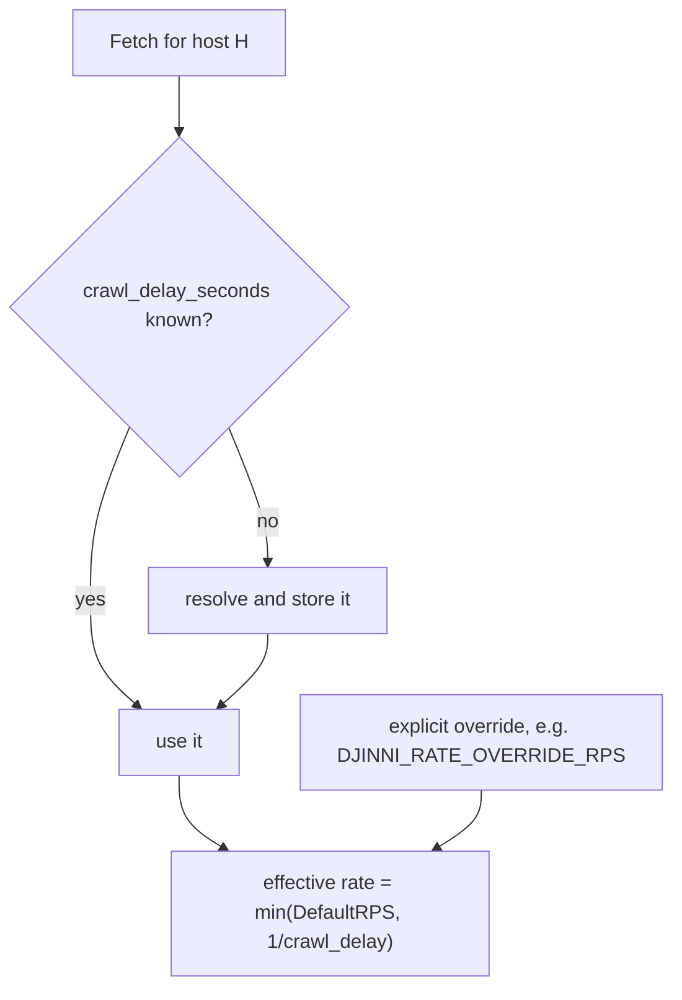
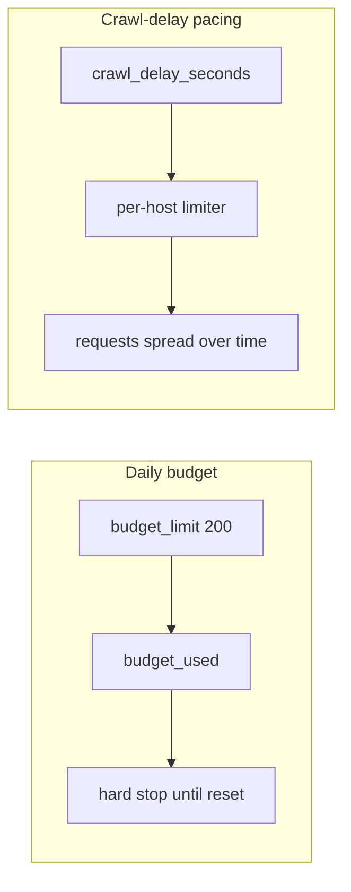

# Rate limiting and pacing

## The mechanism: a `RoundTripper`, not a helper

```go
// internal/ratelimit/transport.go
// Package ratelimit provides a per-host outbound HTTP rate limiter, applied
// as an http.RoundTripper so every request made through a wrapped client is
// paced whether it goes through a helper or through the raw *http.Client.
```

This is the load-bearing design decision. Pacing implemented as a helper function is
pacing an adapter can forget to call; pacing implemented as a transport is unavoidable.



## Defaults

```go
const DefaultRPS   = 0.7  // deliberately below one request per second
const DefaultBurst = 2    // a search page plus its first detail fetch
const rateResolutionTTL = 5 * time.Minute
```

The comments give the reasoning verbatim:

- **`DefaultRPS = 0.7`** — *"the scrapers are hitting job boards that publish crawl delays
  in that range, and nothing in this system is latency-sensitive enough to justify going
  faster."*
- **`DefaultBurst = 2`** — lets a run open with two back-to-back requests before settling
  into the steady rate.
- **`rateResolutionTTL = 5m`** — *"short enough that a crawl delay discovered mid-session
  takes effect without a restart; long enough that resolution never sits in the
  per-request hot path."*

## Why it exists

From the `Transport` doc comment: adapters used to be unthrottled apart from fixed sleeps
in the enrich path, so a single multi-page search could fire pages as fast as the network
allowed — and two concurrent ingest tasks on the same board multiplied that. The
conclusion is stated plainly: *"A host that answers by rate-limiting or banning costs far
more than the delay does."*



## Crawl-delay awareness

Per-host state stores `crawl_delay_seconds` (`00026_host_retrieval_state.sql`), learned
from the host. `ServiceImpl.Fetch` resolves it when absent (`service_impl.go:69-70`), and
the limiter's resolver picks it up within the 5-minute TTL.



Overrides are assembled at startup (`cmd/server/platform.go:80-84`):

```go
rateOverrides := map[string]float64{}
if cfg.DjinniRateOverrideRPS > 0 {
    rateOverrides["djinni.co"] = cfg.DjinniRateOverrideRPS
}
retrieval.ConfigureDefaultTransport(stateStore, rateOverrides)
```

## Throttle only — the budget is gone

Migration `00029_drop_host_budget.sql` removed the per-host **daily budget** in favour of
crawl-delay-aware pacing (spec 017, "throttle-only rate control").

| Before | After |
| --- | --- |
| N requests per host per day, then hard stop | continuous pacing, no daily cap |
| A big search could exhaust the day's quota mid-run | a big search simply takes longer |
| Budget columns actively enforced | columns remain, unused |



The failure mode being fixed: a quota that stops a run halfway leaves the data set in a
worse state than a run that finishes slowly.

## Detail-fetch delays

Two sources have explicit per-detail sleeps on top of the transport pacing, wired in
`composeEnrichment` (`cmd/server/compose_features.go`):

| Variable | Source | Purpose |
| --- | --- | --- |
| `DJINNI_DETAIL_DELAY_MS` | `djinni` | delay between detail-page fetches |
| `WORKUA_DETAIL_DELAY_MS` | `workua` | same |

These predate the transport and remain because the enrich loop's access pattern —
many sequential detail pages — benefits from an explicit, source-tuned gap.

## Separation from AI traffic

`llm.tunedTransport` is deliberately distinct from `retrieval.DefaultTransport`
(`internal/llm/factory.go:8-20`, citing FR-003): *"AI provider traffic must never pick up
the scraper's request pacing."* Pacing a Cerebras call at 0.7 rps would be absurd; the LLM
transport instead raises `MaxIdleConnsPerHost` so hosted concurrency does not force a
fresh TLS handshake per request.

## Testing

`internal/ratelimit/transport_test.go` measures pacing against a `recordingRT` stub that
stands in for the network, so the tests assert delay behaviour rather than round-trip
latency.
