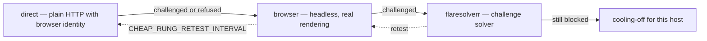
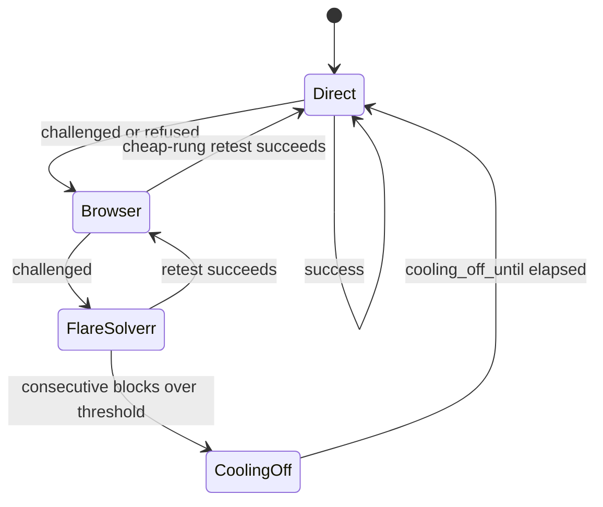
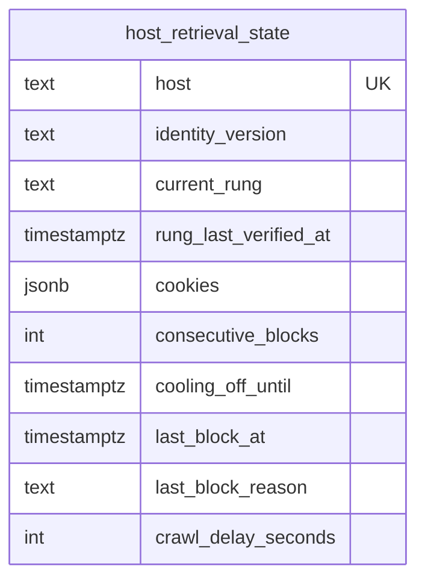
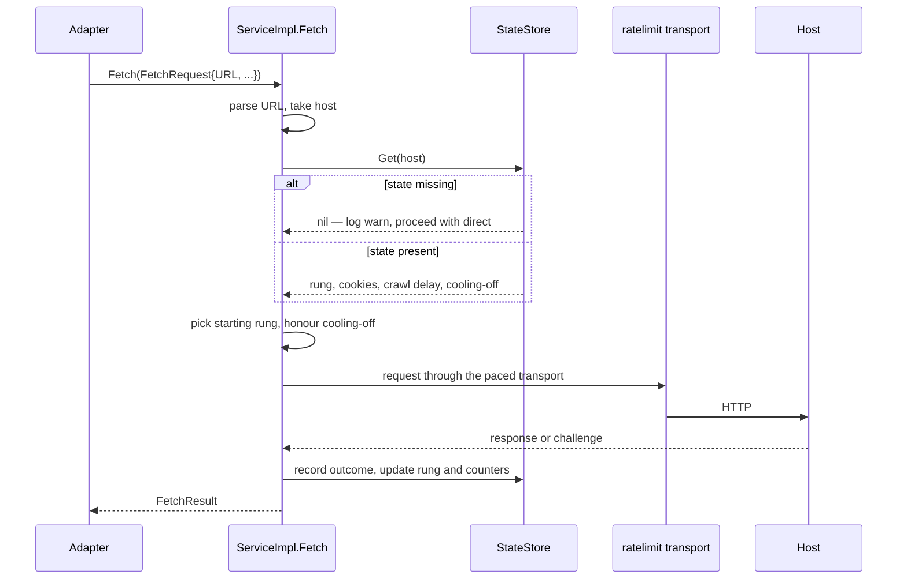

# Retrieval and the fetch ladder

`internal/retrieval` is the single HTTP retrieval interface for every scraped adapter
(spec 014, browser-fidelity fetch ladder). No adapter implements its own request strategy
or challenge handling.

## The ladder

The ladder lives in the job-scraper library — `retrieval/rung.go`:

```go
// Rung keys. A key is stored in HostState.CurrentRung, so renaming one
// is a data migration.
const (
    KeyDirect       = "direct"
    KeyBrowser      = "browser"
    KeyFlareSolverr = "flaresolverr"
)

// Rung is one strategy for fetching a page. A caller can add its own
// (a proxy pool, a commercial unblocking API) by implementing this
// interface and passing WithRung.
type Rung interface { ... }
```

This repo only configures it: `retrieval.NewService` builds the engine with the browser
and FlareSolverr rungs and the cooling-off knobs (`internal/retrieval/service_impl.go:16-24`).



| Rung | Cost | Availability |
| --- | --- | --- |
| `direct` | lowest | always |
| `browser` | high | requested by `WithBrowser(true)`; a rung reports `Available()` false when its browser cannot initialise, and is skipped |
| `flaresolverr` | highest | only when `FLARESOLVERR_URL` is set — `WithFlareSolverr("")` adds no rung |

The service degrades rather than failing: an unavailable rung is simply absent from the
ladder.

## Escalation rules

1. **Start at the host's remembered rung.** `host_retrieval_state.current_rung` persists
   what worked last time, so a host that always challenges is not probed from `direct`
   every run.
2. **Escalate one rung at a time.** `Ladder.Next(key)` walks the rungs in cost order
   (`retrieval/rung.go:99`).
3. **Never escalate a credentialed source.** A request with `UsesUserAccount` records the
   block and returns instead of climbing (`retrieval/engine.go:135-141`) — replaying an
   authenticated session through another transport invalidates it and risks the account.
4. **Retest the cheap rung periodically.** `CHEAP_RUNG_RETEST_INTERVAL` governs when a
   host pinned to an expensive rung is tried at `direct` again.
5. **Cool off after repeated blocks.** `COOLING_OFF_THRESHOLD` consecutive blocks set
   `cooling_off_until` for `COOLING_OFF_BASE_DURATION`.



## Outcomes are a vocabulary

```go
// internal/retrieval/outcome.go
const (
    PageRead        PageStatus = "read"
    PageChallenged  PageStatus = "challenged"
    PageRefused     PageStatus = "refused"
    PageUnparseable PageStatus = "unparseable"
    PageDeferred    PageStatus = "deferred"
)

const (
    VerdictSuccess RunVerdict = "success"
    VerdictPartial RunVerdict = "partial"
    VerdictBlocked RunVerdict = "blocked"
)
```

`PageOutcome` carries `{Status, Method, Reason, URL}` — the rung that produced the result
is part of the record, which is what makes "this host now needs the browser" observable
rather than guessed.

## Browser identity

`retrieval.NewBrowserIdentity(version)` builds a coherent identity — headers, user agent,
and the rest — from a named version. `BROWSER_IDENTITY_VERSION` defaults to `chrome126`
(`cmd/server/platform.go:71-75`). Identity is versioned rather than ad-hoc so a fingerprint
change is one config value, and `host_retrieval_state.identity_version` records which
identity a host last accepted.

## Per-host state



The store is constructed with the encryption key
(`retrieval.NewStateStore(database.Queries, cfg.ConfigEncryptionKey)`,
`platform.go:78`) — **cookies are encrypted at rest**.

## Fetch flow



Note the failure posture at `service_impl.go:63-67`: if reading per-host state fails, the
fetch **proceeds with `direct`** rather than aborting. A degraded state store slows things
down; it does not stop discovery.

## Operator controls

| Endpoint | Effect |
| --- | --- |
| `GET /api/hosts/{host}/retrieval-status` | current rung, blocks, cooling-off, crawl delay |
| `POST /api/hosts/{host}/clear-rung-preference` | forget the remembered rung, start at `direct` |
| `POST /api/hosts/{host}/clear-cookies` | drop the stored session |
| `POST /api/hosts/{host}/override-cooling-off` | resume immediately |

## Lifecycle

`ServiceImpl.Close()` closes the browser and FlareSolverr rungs
(`service_impl.go:48-55`); `scraping.Service.Close()` is deferred in `main.run`
(`cmd/server/main.go:46`). A headless browser left running after shutdown is a real leak,
so the ownership chain is explicit.
