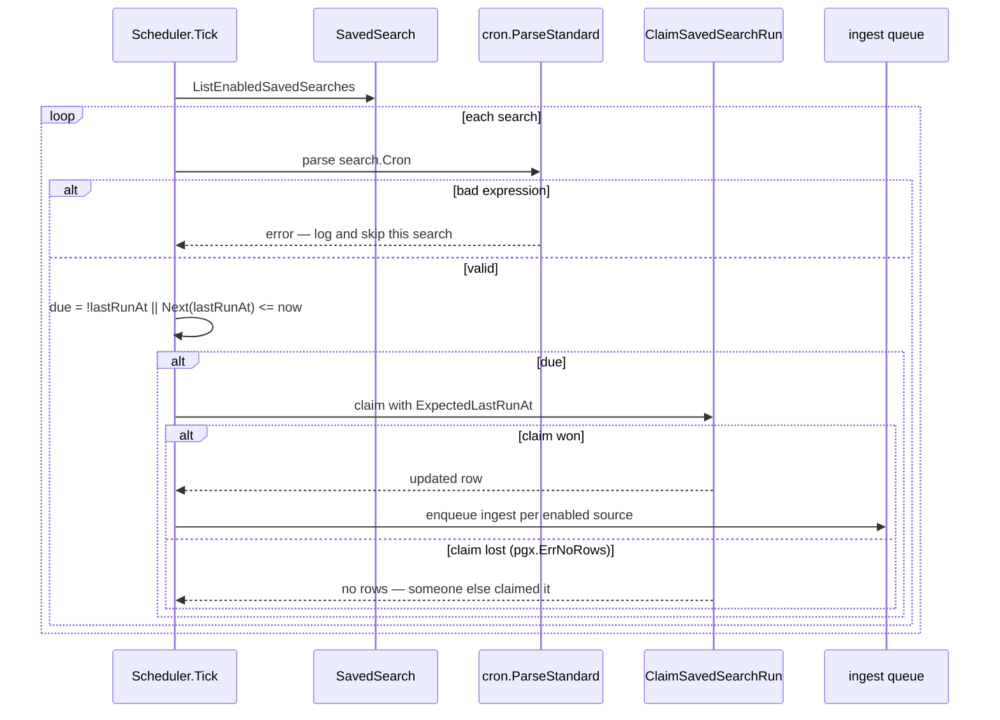
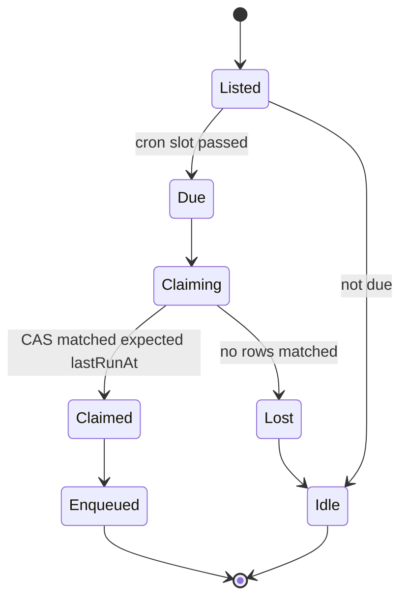
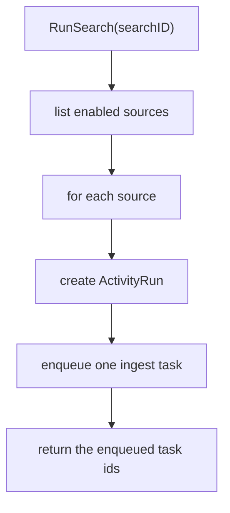
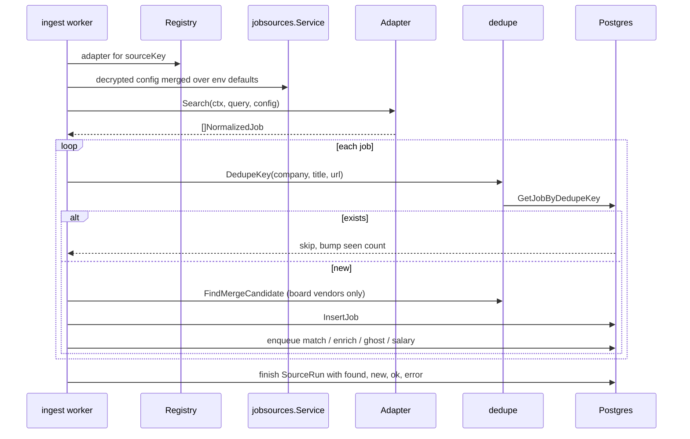

# Scheduler and runs

## The tick

`ingestion.Scheduler` replicates a simple rule (`scheduler.go:17-25`): every five minutes,
for each enabled `SavedSearch`, run it if its cron slot has passed since `lastRunAt`.

```go
due := !search.LastRunAt.Valid || !schedule.Next(search.LastRunAt.Time).After(now)
```

The doc comment records the derivation: the natural formulation is
`due = !lastRunAt || lastRunAt < prev(cron slot before now)`, but `robfig/cron` exposes
only `Next()`, so the equivalent `Next(lastRunAt) <= now` is used instead.



## The claim is the concurrency control

`ClaimSavedSearchRun` is a compare-and-swap on `lastRunAt`: the update only matches if the
row still holds the value the scheduler read. The comment at `scheduler.go:51-56` states
the guarantee — *"a due search is scraped once per slot no matter how many API replicas
are running"* — and it also covers the single-process race where the search ran between
the `List` and the claim.



:::tip A bad cron expression is not fatal
`cron.ParseStandard` failures are logged with the search name and skipped
(`scheduler.go:44-47`). One malformed schedule cannot stop the other searches from
running.
:::

## Three ways a run starts

| Trigger | Entry point | Payload |
| --- | --- | --- |
| Cron | `Scheduler.Tick` every 5 minutes | `IngestPayload{SearchID, SourceKey}` |
| Manual search | `POST /api/searches/{id}/run` → `Service.RunSearch` (`runner.go:17`) | same |
| Manual source | `POST /api/sources/{key}/run` → `Service.RunSource` (`runner.go:86`) | `IngestPayload{SourceKey}` with no search |
| Subscription | subscription cron → `subscription_runner.go` | `IngestPayload{SubscriptionID, SourceKey}` |

`IngestPayload` documents the invariant (`internal/queue/queue.go:51-59`): exactly one of
`SearchID` / `SubscriptionID` is set; both nil means "scrape with an empty query", which
is what a direct source test does.

```go
type IngestPayload struct {
    SearchID       *string `json:"searchId"`
    SubscriptionID *string `json:"subscriptionId,omitempty"`
    SourceKey      string  `json:"sourceKey"`
    ActivityID     *string `json:"activityId,omitempty"`
}
```

## Fan-out per run



`RunSearch` returns the enqueued ids so the HTTP layer can hand the dashboard something to
poll.

## Inside the ingest handler



## Run records

Two tables observe a run:

| Table | Scope | Key fields |
| --- | --- | --- |
| `SourceRun` | one source's scrape | `sourceId`, `searchId`, `startedAt`, `finishedAt`, `ok`, `found`, `new`, `error` |
| `ActivityRun` | one task, any type | `op`, `state`, `label`, `step`, `queueTaskId`, `error`, `meta` |

`GET /api/searches/runs/recent` reads `SourceRun`; the Status page reads `ActivityRun`.

## Reconciliation

`internal/ingestion/reconcile.go` handles the drift between what a source reports now and
what is already stored — the case where a posting disappears or a board's identifiers
shift. `merge_test.go` covers merging a board-vendor job into an existing aggregator job;
see [Deduplication](/ingestion/deduplication-and-quality).
