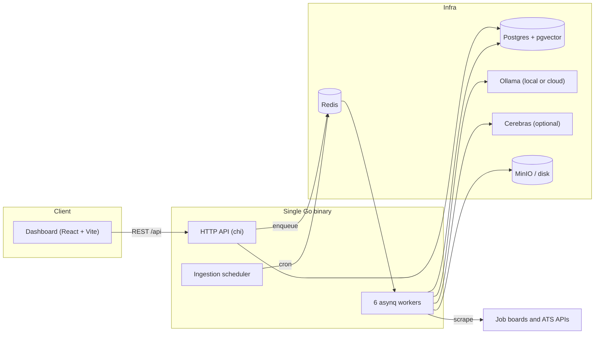
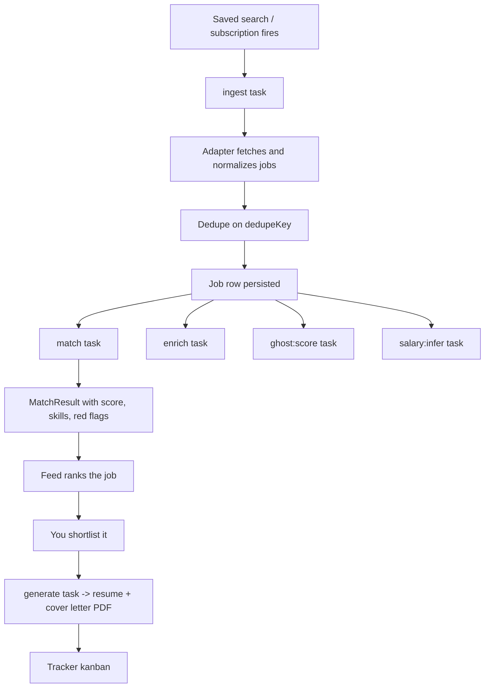

# Job Finder

Job Finder is a **self-hosted, modular AI job-search platform**. It discovers jobs across
many sources, scores them against your master profile with an LLM, generates grounded
tailored resumes and cover letters, and tracks applications on a kanban board.

:::info Design constraint
You apply manually. There is **no auto-apply**, by design. Every outbound action is a
human decision; the platform only prepares the material.
:::

## The system in one picture



The API, the workers and the scheduler are **goroutines inside one process**
(`apps/api/cmd/server/main.go:41-56`). There is no service mesh to operate: one binary,
one Postgres, one Redis.

## What it actually does



## Repository layout

| Path | What lives there |
| --- | --- |
| `apps/api` | Go backend: HTTP API, asynq workers, ingestion scheduler, all domain logic |
| `apps/dashboard` | React 19 + Vite 6 dashboard (TanStack Query, Tailwind 4, Radix, dnd-kit) |
| `packages/shared` | Shared TypeScript types mirroring the Go DTOs |
| `specs/NNN-*` | Per-feature specification, plan, tasks, checklists |
| `.specify/` | Spec-driven-development tooling, templates, project constitution |
| `scripts/` | Drift checks (`sqlc-check.sh`, `tygo-check.sh`) and helpers |

## Quickstart

```bash
cp .env.example .env        # set DB_PASSWORD, CONFIG_ENCRYPTION_KEY (openssl rand -hex 32)
just up                     # postgres + redis (+ ollama) via docker compose
pnpm install
pnpm --filter @job-finder/shared build
just run-backend            # Go API + workers + scheduler on :3000
just run-frontend           # Vite dev server on :5173
```

Everything else — targets, ports, seeding, test databases — is in
[Local development](/operations/local-development).

:::warning Long-lived processes
`just run-backend`, `just run-frontend` and `just run-all` never return. Start them
through a process supervisor, not a blocking shell call (`AGENTS.md`).
:::

## Where to read next

| If you want to… | Read |
| --- | --- |
| Understand the rules the code plays by | [Principles overview](/principles/overview) |
| See how the pieces fit | [System overview](/architecture/system-overview) |
| Work on the Go backend | [Backend overview](/backend/overview) |
| Touch the database | [Data overview](/data/overview) |
| Add or fix a job source | [Job sources](/ingestion/job-sources) |
| Change AI behaviour | [AI overview](/ai/overview) |
| Debug a stuck queue | [Async overview](/async/overview) |
| Work on the UI | [Frontend overview](/frontend/overview) |
| Run, test, or ship it | [Local development](/operations/local-development) |

## Reading these docs

Every page is written against the code as it exists in this repository, with
`path/file.go:LINE` citations. When a doc and the code disagree, the code wins — and the
doc is a bug.
