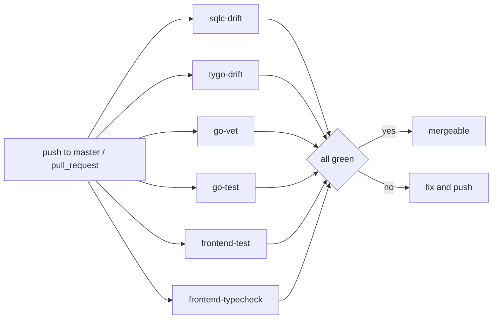
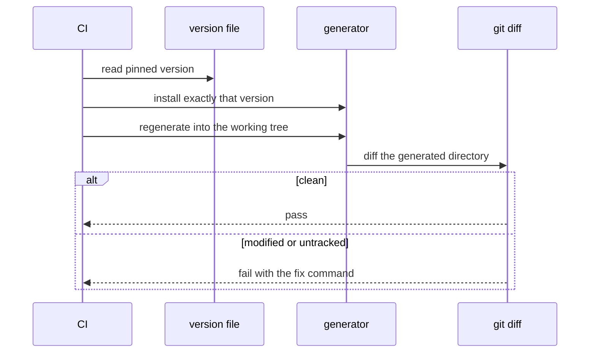
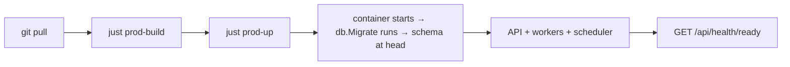

# CI and delivery

## The workflow

`.github/workflows/api-ci.yml`, named **API CI**, triggered on push to `master` and on
every pull request.



Six independent jobs, no dependencies between them — a failure in one does not mask the
others.

## Jobs

| Job | Name | Gates |
| --- | --- | --- |
| `sqlc-drift` | *sqlc generate is up to date* | committed `sqlcgen` matches migrations + queries |
| `tygo-drift` | *tygo generate is up to date* | committed `generated.ts` matches Go DTOs |
| `go-vet` | *go vet* | `go vet ./...` in `apps/api` |
| `go-test` | *go test* | `go test ./...` in `apps/api` |
| `frontend-test` | *frontend test (vitest)* | dashboard unit tests |
| `frontend-typecheck` | *frontend typecheck* | `pnpm typecheck` |
| `secret-scan` | *secret scan* | no credential in this pull request's commits |
| `vulnerability-scan-go` | *vulnerability scan (go)* | no **reachable** advisory in `apps/api`'s dependencies |
| `vulnerability-scan-web` | *vulnerability scan (web)* | no workspace advisory at `high` or above |
| `build-image-api` | *build image (api)* | `apps/api/Dockerfile` still builds |
| `build-image-dashboard` | *build image (dashboard)* | `apps/dashboard/Dockerfile` still builds |

The last five are the supply-chain and build-integrity gates. Before them, four classes of
defect could merge with every check green: a committed credential, a published advisory
against a dependency, dependency drift, and a container image that no longer builds.

Each is skipped rather than absent on a pull request that cannot affect it — the
distinction matters, because a check that reports *nothing* would sit at "Expected"
forever once branch protection is applied. `secret scan` is the exception that runs on
almost everything: it uses a tree-wide filter, because a key pasted into a markdown file
is still a key.

## Version pinning

```yaml
- name: Read pinned sqlc version
  id: sqlc
  run: echo "version=$(tr -d '[:space:]' < apps/api/.sqlc-version)" >> "$GITHUB_OUTPUT"
- uses: sqlc-dev/setup-sqlc@v4
  with:
    sqlc-version: ${{ steps.sqlc.outputs.version }}
```

Five tools are pinned in-repo this way — `apps/api/.sqlc-version`,
`apps/api/.tygo-version`, `apps/api/.golangci-version`,
`apps/api/.govulncheck-version` and `.gitleaks-version` — and each local check script
refuses to run on a mismatched version. Without that, the drift
check would flap between machines whenever someone upgraded a tool.

Go comes from `go-version-file: apps/api/go.mod` — one source of truth for the language
version too.

## Drift jobs in detail



`scripts/sqlc-check.sh` also checks **untracked** files (`git ls-files --others`), catching
a brand-new query whose `.sql.go` was never `git add`ed — the case a plain
`git diff --exit-code` misses.

Failure output tells you exactly what to run:

```
sqlc output is stale: apps/api/internal/db/sqlcgen does not match the migrations and
queries in apps/api/internal/db.

Regenerate and commit the result:
  just sqlc-generate
  git add apps/api/internal/db/sqlcgen
```

## Frontend jobs

Both do the same three steps before their real work:

```yaml
- uses: pnpm/action-setup@v4
  with: { version: 11 }
- uses: actions/setup-node@v4
  with: { node-version: 22, cache: pnpm }
- run: pnpm install --frozen-lockfile
- run: pnpm --filter @job-finder/shared build
```

The shared build is mandatory: the dashboard imports `@job-finder/shared` from `dist/`, so
without it both jobs would compile against stale or missing declarations.

`--frozen-lockfile` means a lockfile that was not committed alongside a `package.json`
change fails the build.

## What CI does not do

| Not covered | Why | Mitigation |
| --- | --- | --- |
| Integration tests against production data | fixtures only, by design | the suite seeds every row it asserts on |
| E2E | needs the full stack | run `just test-e2e` locally |
| Live smoke tests | hits real sites and paid APIs | run manually when diagnosing |
| `index.ts` versus Go DTOs | `index.ts` is hand-maintained | review — see [shared types](/frontend/shared-types) |
| Go formatting | not a job | `gofmt` locally |
| Deployment | no deploy workflow in the repo | see below |

## Fixing each failure

| Failing job | Likely cause | Fix |
| --- | --- | --- |
| `sqlc-drift` | edited a migration or query without regenerating | `just sqlc-generate && git add apps/api/internal/db/sqlcgen` |
| `tygo-drift` | edited a DTO without regenerating | `just tygo-generate && git add packages/shared/src/generated.ts` |
| `go-vet` | shadowing, unreachable code, bad printf verb | read the message; vet is rarely wrong |
| `go-test` | a real regression | reproduce with `just test-go` |
| `frontend-test` | component or contract change | `just test-react` |
| `frontend-typecheck` | shared types not mirrored, or a real type error | rebuild shared, then `pnpm typecheck` |
| `secret scan` | a credential shape in your commits | **rotate the credential first** — it is already pushed — then remove it. See below |
| `vulnerability scan (go)` | a reachable advisory | `cd apps/api && go get <module>@<fixed> && go mod tidy` |
| `vulnerability scan (web)` | an advisory at `high`+ | bump the package; reproduce with `just vuln-web` |
| `build image (api)` / `(dashboard)` | the Dockerfile broke | fix it — there is no suppression path, by design |

## Responding to a supply-chain gate

### A secret was detected

Treat it as public: it is in a pushed branch, and anyone with read access — plus every
clone and fork — has it. **Rotate the credential before doing anything else.** Then remove
it from the change.

Only if the finding is genuinely not a secret, add an entry to `.gitleaks.toml` with a
comment saying why. Keep it narrow — a bare `.*` path or regex is never acceptable, and the
allowlist has two blocks because gitleaks matches `regexes` against the captured secret by
default, while some false positives are only recognisable from the surrounding line
(`regexTarget = "line"`).

The scan never prints the matched value in full: `--redact` is mandatory, because the
workflow log is itself readable.

### A Go advisory blocks the merge

`govulncheck` fails only on advisories **reachable** from this module's own code — call
graph, not dependency graph. An unreachable finding is printed and passes. This is what
keeps the gate actionable: at the time it was introduced, three real advisories against
real dependencies were unreachable, and failing on those would have made the gate noise
within a week.

If a fix exists, bump. If it does not, add an expiring entry to
`apps/api/.govulncheck-ignore`:

```
GO-2026-1234  2026-10-01  No fixed version upstream; reachable only from <path>
```

The expiry is the point — an expired entry **fails** the gate rather than lapsing into
silence, so keeping an exception means renewing it in a reviewed diff. A malformed line, a
duplicate, and an entry for an advisory that no longer appears all fail too.

```bash
./scripts/govulncheck-check.sh --self-test   # proves all six parser failure modes offline
```

### A web advisory blocks the merge

The severity floor is `high`, set explicitly in the workflow rather than left to a default.
`moderate` was considered and rejected: nearly every moderate finding in a Vite/React
devDependency tree is a build-time-only ReDoS that a deployed static bundle cannot reach.

Exceptions go in `auditConfig.ignoreCves` in **`pnpm-workspace.yaml`** — not
`package.json`, which pnpm 11 no longer reads for this — and every id needs a row in the
table in `specs/domains/platform-operations.md` § 3.2 giving the reason.

### An image build fails

Fix the Dockerfile. There is deliberately no suppression mechanism: a vulnerability or a
secret match can be a false positive or an unfixable upstream fact, but an image that does
not build is never either.

Reproduce with `just images`.

## Automated dependency updates

`.github/dependabot.yml` opens weekly grouped pull requests for the Go module, the pnpm
workspace, the workflow's actions, and both Dockerfiles' base images. Minor and patch
arrive batched; majors arrive individually, so a breaking change is never hidden behind a
diff of twenty other bumps. Each ecosystem has an open-pull-request cap.

It does **not** read compose files, so the images in `docker-compose.yml` and
`docker-compose.prod.yml` stay manual.

## Pre-push checklist

```bash
just test-lint                     # go test + vitest + both linters
just sqlc-check                    # drift
just tygo-check                    # drift
pnpm typecheck
cd apps/api && go vet ./...
```

That reproduces every CI job whose verdict depends only on the tree.

The supply-chain gates are separate, because theirs does not:

```bash
just audit                         # vuln-go + vuln-web + secrets
just images                        # both container builds (slow: 6-8 min cold)
```

`just audit` is not part of `test-lint` on purpose. An advisory published this afternoon
turns this morning's green run red with no commit in between, so a passing local run
cannot promise a passing CI run — which is the whole promise `test-lint` exists to make.
Run it when you touch dependencies.

## Delivery

There is no deployment workflow in this repository — it is a self-hosted product. Shipping
means building the images and running the production compose file:

```bash
just prod-build
just prod-up
```



Because migrations run inside `main.run`, a deploy is *"start the new binary"* — no
separate migrate step, and no window where the code is ahead of the schema.

:::warning asynqmon is not in the production compose file
It ships with no authentication. `docker-compose.prod.yml` deliberately omits it.
:::
