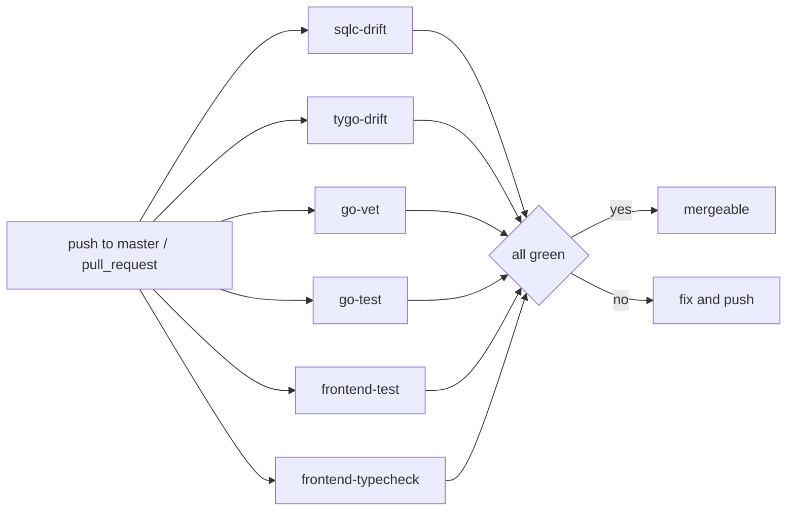
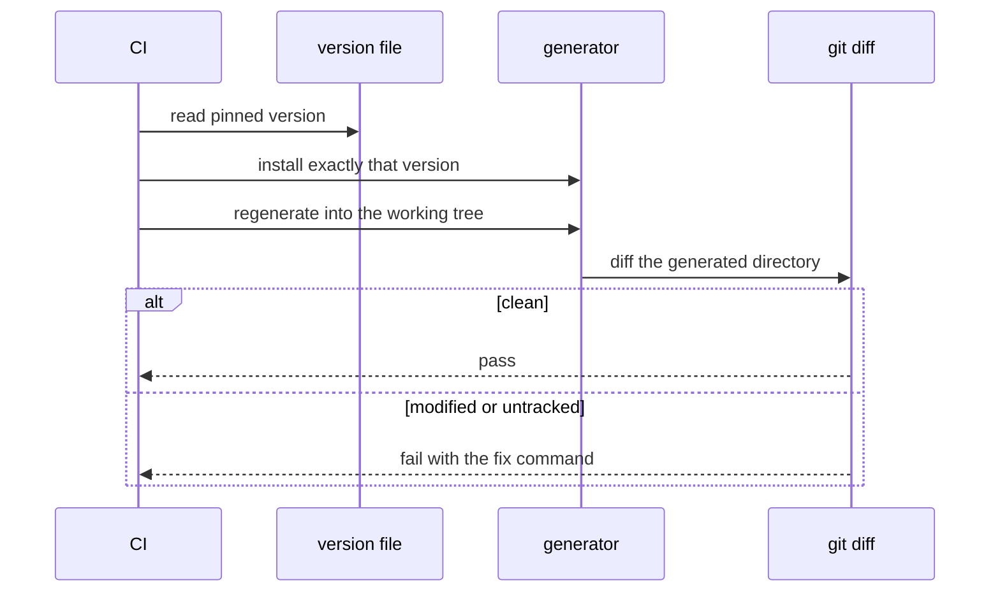
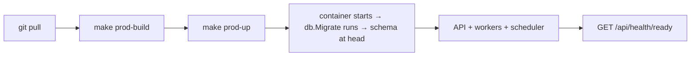

# CI and delivery

## The workflow

`.github/workflows/api-ci.yml`, named **API CI**, triggered on push to `master` and on
every pull request.



Six independent jobs, no dependencies between them — a failure in one does not mask the
others.

## Jobs

| Job | Name | Gates |
| --- | --- | --- |
| `sqlc-drift` | *sqlc generate is up to date* | committed `sqlcgen` matches migrations + queries |
| `tygo-drift` | *tygo generate is up to date* | committed `generated.ts` matches Go DTOs |
| `go-vet` | *go vet* | `go vet ./...` in `apps/api` |
| `go-test` | *go test* | `go test ./...` in `apps/api` |
| `frontend-test` | *frontend test (vitest)* | dashboard unit tests |
| `frontend-typecheck` | *frontend typecheck* | `pnpm typecheck` |

## Version pinning

```yaml
- name: Read pinned sqlc version
  id: sqlc
  run: echo "version=$(tr -d '[:space:]' < apps/api/.sqlc-version)" >> "$GITHUB_OUTPUT"
- uses: sqlc-dev/setup-sqlc@v4
  with:
    sqlc-version: ${{ steps.sqlc.outputs.version }}
```

Both generators are pinned in-repo (`apps/api/.sqlc-version`, `apps/api/.tygo-version`),
and the local check script refuses to run on a mismatched version. Without that, the drift
check would flap between machines whenever someone upgraded a tool.

Go comes from `go-version-file: apps/api/go.mod` — one source of truth for the language
version too.

## Drift jobs in detail



`scripts/sqlc-check.sh` also checks **untracked** files (`git ls-files --others`), catching
a brand-new query whose `.sql.go` was never `git add`ed — the case a plain
`git diff --exit-code` misses.

Failure output tells you exactly what to run:

```
sqlc output is stale: apps/api/internal/db/sqlcgen does not match the migrations and
queries in apps/api/internal/db.

Regenerate and commit the result:
  make sqlc-generate
  git add apps/api/internal/db/sqlcgen
```

## Frontend jobs

Both do the same three steps before their real work:

```yaml
- uses: pnpm/action-setup@v4
  with: { version: 11 }
- uses: actions/setup-node@v4
  with: { node-version: 22, cache: pnpm }
- run: pnpm install --frozen-lockfile
- run: pnpm --filter @job-finder/shared build
```

The shared build is mandatory: the dashboard imports `@job-finder/shared` from `dist/`, so
without it both jobs would compile against stale or missing declarations.

`--frozen-lockfile` means a lockfile that was not committed alongside a `package.json`
change fails the build.

## What CI does not do

| Not covered | Why | Mitigation |
| --- | --- | --- |
| Integration tests | needs Postgres | run `make test-integration` locally |
| E2E | needs the full stack | run `make test-e2e` locally |
| Live smoke tests | hits real sites and paid APIs | run manually when diagnosing |
| `index.ts` versus Go DTOs | `index.ts` is hand-maintained | review — see [shared types](/frontend/shared-types) |
| Go formatting | not a job | `gofmt` locally |
| Deployment | no deploy workflow in the repo | see below |

## Fixing each failure

| Failing job | Likely cause | Fix |
| --- | --- | --- |
| `sqlc-drift` | edited a migration or query without regenerating | `make sqlc-generate && git add apps/api/internal/db/sqlcgen` |
| `tygo-drift` | edited a DTO without regenerating | `make tygo-generate && git add packages/shared/src/generated.ts` |
| `go-vet` | shadowing, unreachable code, bad printf verb | read the message; vet is rarely wrong |
| `go-test` | a real regression | reproduce with `make test-go` |
| `frontend-test` | component or contract change | `make test-react` |
| `frontend-typecheck` | shared types not mirrored, or a real type error | rebuild shared, then `pnpm typecheck` |

## Pre-push checklist

```bash
make test-lint                     # go test + vitest
make sqlc-check                    # drift
make tygo-check                    # drift
pnpm typecheck
cd apps/api && go vet ./...
```

That is every CI job reproduced locally.

## Delivery

There is no deployment workflow in this repository — it is a self-hosted product. Shipping
means building the images and running the production compose file:

```bash
make prod-build
make prod-up
```



Because migrations run inside `main.run`, a deploy is *"start the new binary"* — no
separate migrate step, and no window where the code is ahead of the schema.

:::warning asynqmon is not in the production compose file
It ships with no authentication. `docker-compose.prod.yml` deliberately omits it.
:::
