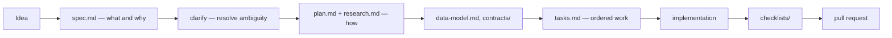
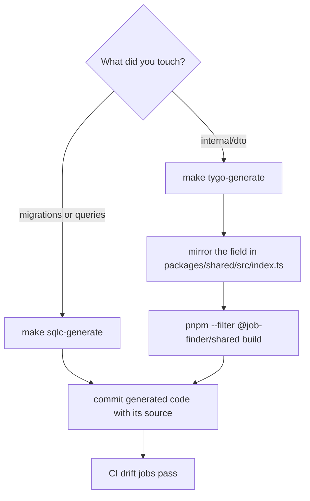
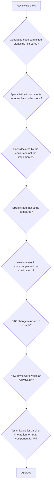

# Contributing

## The spec-driven workflow

Features begin as a numbered directory under `specs/`, not as a branch of code.



A mature feature directory (`specs/019-ai-job-throughput`) contains:

| File | Contents |
| --- | --- |
| `spec.md` | requirements as numbered `FR-NNN` items |
| `plan.md` | implementation plan |
| `research.md` | investigated options, numbered `R1`, `R2`, … |
| `data-model.md` | schema and type changes |
| `contracts/` | API contracts |
| `tasks.md` | dependency-ordered tasks |
| `checklists/` | verification |
| `quickstart.md` | how to exercise the feature |

Templates live in `.specify/templates/`; the project constitution is
`.specify/memory/constitution.md`.

### Why the numbering matters in code

Code comments cite the spec that produced them:

```go
// Each task type gets its own server (own worker pool + own queue), so its
// Concurrency is a hard per-queue cap ... (019-ai-job-throughput, research.md R3).
```

```go
// A remote provider selected without a configured credential falls back to
// Ollama (FR-008) ...
```

That citation is how a future reader recovers the reasoning without archaeology. **Keep
doing it**: cite the spec number and the specific requirement or research item.

Existing features run `001` through `019` — Cerebras toggle, several job providers,
skeleton loading, CI gate, health checks, editable resume, ATS boards, the fetch ladder,
Djinni search modes, throttle-only rate control, asynqmon, AI throughput.

## Branches and commits

From `AGENTS.md`:

- Conventional commits: `feat:`, `fix:`, `chore:`, `docs:`.
- Create commits after completing a feature, refactor, or significant change.
- **Only commit files you changed.**

```
feat(retrieval): replace per-host daily budget with crawl-delay-aware pacing
fix(httpapi): drop hardcoded /v1 prefix from ai-features/ext/llm-settings routes
chore: remove RESUME_MASTER_PATH, resume loaded via dashboard only
```

Scopes name the package or area.

## Code generation is part of the change



| Change | Required commands |
| --- | --- |
| Migration or query | `make sqlc-generate` |
| DTO field | `make tygo-generate` + edit `index.ts` + rebuild shared |
| New handler | mount it in `NewRouter(...)` in `cmd/server/servers.go`, not in `router.go` |
| New task type | queue constants, payload, `TaskPolicy`, worker line, `queueForOp` entry |
| New job source | adapter + fixtures + registry entry in `compose_sources.go` |

Install the pinned generators once: `make sqlc-install`, `make tygo-install`.

## Before opening a PR

```bash
make test-lint          # go test + vitest
make sqlc-check
make tygo-check
pnpm typecheck
cd apps/api && go vet ./...
```

That reproduces all six CI jobs. If the change touches SQL, also run
`make test-integration`.

## Code expectations

| Expectation | Where it comes from |
| --- | --- |
| Services depend on ports they declare | [DI](/principles/dependency-injection) |
| Wiring lives in `cmd/server` | [composition root](/architecture/composition-root) |
| Errors are `apperr` kinds, mapped once | [error handling](/principles/error-handling) |
| Generated code is committed, never edited | [coding conventions](/principles/coding-conventions) |
| Comments explain *why* and cite the spec | same |
| Adapters fetch through `internal/retrieval` | [ingestion](/ingestion/overview) |
| AI features degrade rather than fail | [AI overview](/ai/overview) |
| New UI state gets a skeleton | [state and data](/frontend/state-and-data) |

## Review checklist



Extra scrutiny for:

- **Anything touching `DedupeKey`.** It must stay byte-compatible or every stored key is
  invalidated.
- **New outbound HTTP.** It must go through `retrieval` (scraping) or the tuned LLM
  transport — never a bare `http.Get`.
- **Anything that could run a paid model on a schedule.** Ghost scoring is explicitly
  manual-or-ingest-only (FR-014); keep that shape.
- **Migrations.** Append-only, with a `Down`, and a backfill before a constraint.

## Documentation

These docs live in `docs/` and are built with Docusaurus:

```bash
cd docs
pnpm start     # dev server with hot reload
pnpm build     # production build
```

Pages are Markdown with Mermaid enabled (```mermaid fences) and autogenerated sidebars —
adding a file to a category directory is enough. Cite `path/file.go:LINE` when documenting
behaviour, so a reader can verify the claim and a future reader can spot the drift.

When code and docs disagree, the code wins and the doc is a bug.
