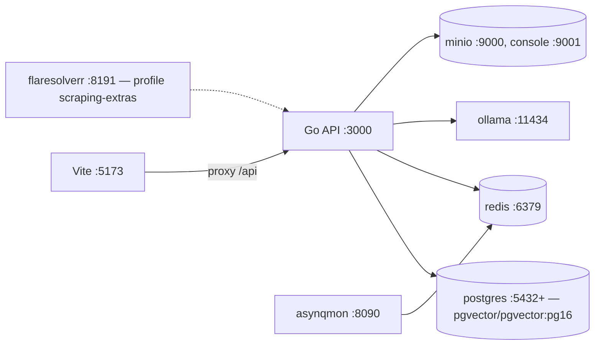
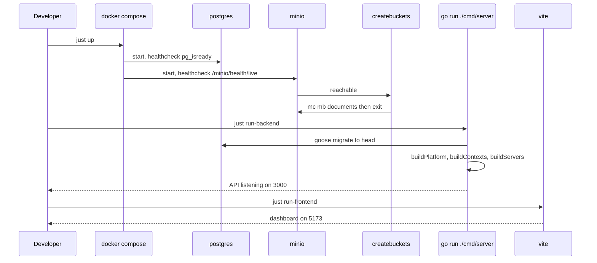

# Local development

## Prerequisites

| Tool | Why |
| --- | --- |
| Go (version from `apps/api/go.mod`) | backend |
| Node ≥ 20 (CI uses 22) | dashboard |
| pnpm 11 | workspace package manager |
| Docker + Compose | Postgres, Redis, MinIO, Ollama, asynqmon |
| `sqlc` at the pinned version | `just sqlc-install` |
| `tygo` at the pinned version | `just tygo-install` |

## First run

```bash
cp .env.example .env
# set DB_PASSWORD and CONFIG_ENCRYPTION_KEY (openssl rand -hex 32)

just up                                        # postgres, redis, asynqmon, ollama, minio
pnpm install
pnpm --filter @job-finder/shared build
just run-backend                               # :3000 — migrates on startup
just run-frontend                              # :5173
```

`db.Migrate` runs inside `main.run`, so there is no separate migration step.

:::warning Long-lived processes
`just run-backend`, `just run-frontend` and `just run-all` never return. Start them under a
process supervisor rather than in a blocking shell call (`AGENTS.md`).
:::

## Topology



## Ports

| Service | Port | Notes |
| --- | --- | --- |
| Dashboard (dev) | 5173 | Vite, proxies `/api` to 3000 |
| API | 3000 | `PORT` |
| Postgres | `POSTGRES_HOST_PORT` | derived per worktree, base 5432 |
| Redis | 6379 | test suite uses DB index 1 |
| asynqmon | 8090 | dev only — deliberately not 8080 |
| MinIO | 9000 / 9001 | API / console |
| Ollama | 11434 | local inference |
| FlareSolverr | 8191 | only with `--profile scraping-extras` |

## Per-worktree isolation

```makefile
WORKTREE_NAME := $(shell basename "$$(git rev-parse --show-toplevel 2>/dev/null || pwd)")
WORKTREE_HASH := $(shell echo "$(WORKTREE_NAME)" | cksum | cut -d' ' -f1)
export COMPOSE_PROJECT_NAME := jobfinder-$(WORKTREE_NAME)
export POSTGRES_HOST_PORT   := $(shell echo "$$(( 5432 + ( $(WORKTREE_HASH) % 100 ) ))")
```

Each worktree gets its own compose project and Postgres host port, *"so migration state
from one branch never leaks into another's test run."* Two branches can run
simultaneously.

## Justfile targets

### Infrastructure

| Target | Effect |
| --- | --- |
| `just up` | `docker compose up -d` |
| `just down` | stop the stack |
| `just logs` | follow compose logs |
| `just ps` | container status |
| `just clean` | `down -v` plus remove `node_modules` and `dist` |

### Running

| Target | Effect |
| --- | --- |
| `just run-backend` | `go run ./cmd/server` |
| `just run-frontend` | `pnpm dev` |
| `just run-all` | `up`, then backend and frontend |

### Tests

| Target | Effect |
| --- | --- |
| `just test` | `test-go` + `test-react` |
| `just test-go` | Go tests against `jobfinder_test` and Redis DB 1 |
| `just test-react` | `npx vitest run` |
| `just test-integration` | `go test -tags integration` — starts its own Postgres/RabbitMQ/ClickHouse containers (testcontainers), needs only Docker |
| `just test-e2e` | compose up, then Playwright |
| `just test-lint` | `test-go` + `test-react` |
| `just test-db-setup` | drop and recreate `jobfinder_test` |

### Code generation

| Target | Effect |
| --- | --- |
| `just sqlc-install` / `just sqlc-generate` / `just sqlc-check` | sqlc at the pin in `apps/api/.sqlc-version` |
| `just tygo-install` / `just tygo-generate` / `just tygo-check` | tygo at the pin in `apps/api/.tygo-version` |

### Data

| Target | Effect |
| --- | --- |
| `just seed` / `just seed-clean` | `go run ./cmd/seed` |
| `just truncate-db` | truncate the ten core tables with `RESTART IDENTITY CASCADE` |

### Production stack

| Target | Effect |
| --- | --- |
| `just prod-build` / `just prod-up` / `just prod-down` | `docker-compose.prod.yml` |

## Compose services

| Service | Image | Notes |
| --- | --- | --- |
| `postgres` | `pgvector/pgvector:pg16` | healthcheck `pg_isready`; `DB_PASSWORD` is required — compose fails loudly without it |
| `redis` | `redis:7-alpine` | |
| `asynqmon` | `hibiken/asynqmon:0.7.2` | dev only; distroless, so no healthcheck |
| `ollama` | `ollama/ollama:latest` | uncomment the `deploy` block for GPU |
| `flaresolverr` | ghcr image | `profiles: [scraping-extras]` — opt in |
| `minio` | `minio/minio:latest` | healthcheck probes via bash `/dev/tcp`, since the image ships no curl or mc |
| `createbuckets` | `minio/mc:latest` | one-shot; creates the documents bucket, then exits |

Two nice touches to copy: `${DB_PASSWORD:?set DB_PASSWORD in .env}` turns a missing
variable into a clear error, and `createbuckets` removes a manual setup step.

## Bring-up sequence



## Common tasks

| Task | Commands |
| --- | --- |
| Reset the database | `just clean && just up && just run-backend` |
| Clear job data only | `just truncate-db` |
| Add a query | edit `internal/db/queries/*.sql`, `just sqlc-generate` |
| Add a DTO field | edit `internal/dto`, `just tygo-generate`, mirror in `packages/shared/src/index.ts`, rebuild shared |
| Try a source | `POST /api/sources/{key}/test` then `/run` |
| Watch the queues | asynqmon at http://localhost:8090 |
| Use Ollama Cloud | `OLLAMA_URL=https://ollama.com`, `OLLAMA_KEY=…`, and point `EMBED_URL` at a local Ollama |

:::note Embeddings need a local Ollama
Ollama Cloud serves no embedding models. With `OLLAMA_URL` pointed at the cloud, set
`EMBED_URL=http://localhost:11434`.
:::
