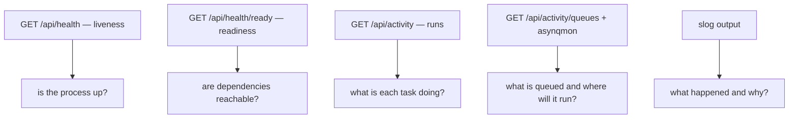
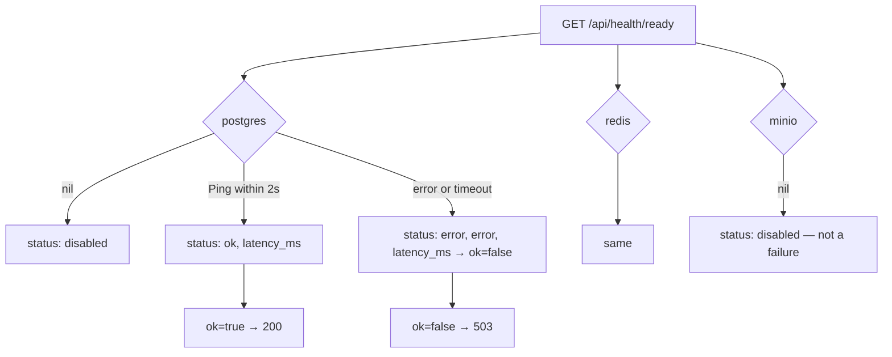
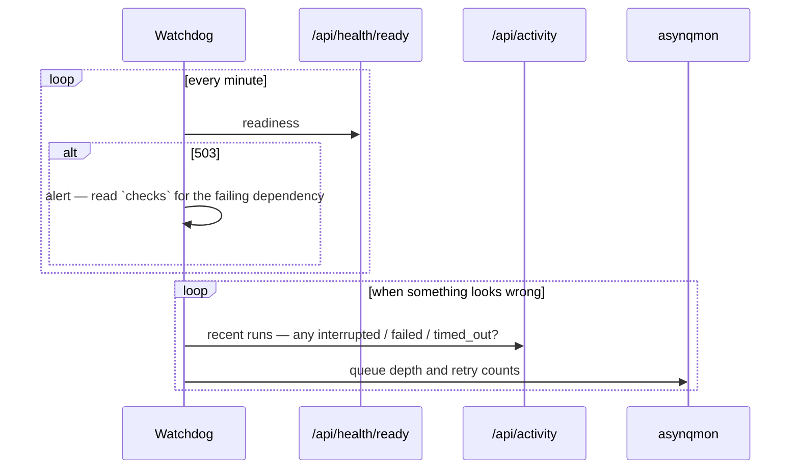

# Observability

Four windows into a running system: health endpoints, `ActivityRun`, the queue view, and
structured logs.



## Liveness

```go
func healthHandler(w http.ResponseWriter, r *http.Request) {
    writeJSON(w, http.StatusOK, map[string]any{
        "ok":     true,
        "uptime": time.Since(startTime).Seconds(),
    })
}
```

Mounted inside `mountAll` (`router.go:28`), so it exists at `/api/health` and
`/api/v1/health`. It touches nothing — it answers "is the process serving HTTP".

## Readiness

Spec 008. `HealthHandler` (`internal/httpapi/health.go`) checks each dependency through a
structural port:

```go
type Pinger interface {
    Ping(ctx context.Context) error
}

type HealthHandler struct {
    Postgres Pinger
    Redis    Pinger
    Minio    Pinger // nil if MinIO is not configured
}
```

`*pgxpool.Pool`, `redis.UniversalClient` and `*minio.Client` (via a small adapter) all
satisfy it with their existing methods.



```json
{
  "ok": true,
  "checks": {
    "postgres": { "status": "ok", "latency_ms": 3 },
    "redis":    { "status": "ok", "latency_ms": 1 },
    "minio":    { "status": "disabled" }
  }
}
```

Three design points:

1. **Each ping has a 2-second bound** (`readinessTimeout`), *"so a hung dependency cannot
   hang the whole /health/ready response"* — the classic readiness failure mode.
2. **Latency is reported per dependency**, so a slow-but-alive Postgres is visible before
   it becomes an outage.
3. **`nil` means `disabled`, not unhealthy.** Unconfigured MinIO reports `disabled` and
   readiness stays green, mirroring the storage package's convention.

Status codes: `200` when all configured checks pass, `503` otherwise.

## Activity runs

Every async operation writes an `ActivityRun` — states, steps, heartbeats, terminal
reasons, and the sweeper that closes out vanished workers.
See [activity tracking](/async/activity-tracking).

| Endpoint | Answers |
| --- | --- |
| `GET /api/activity` | what ran, what is running, what failed and why |
| `GET /api/activity/queues` | backlog per queue and the provider class each will use |
| `GET /api/searches/runs/recent` | per-source scrape outcomes (`SourceRun`) |
| `GET /api/hosts/{host}/retrieval-status` | current rung, blocks, cooling-off, crawl delay |

## Queue visibility

asynqmon on :8090 in development ([monitoring](/async/monitoring)). Redis-level truth —
payloads, retry counts, archived tasks — complementing the business-level view in
`ActivityRun`.

## Logging

Structured `log/slog`, with the default logger held on `Platform.Logger`.

| Level | Used for |
| --- | --- |
| `Error` | 5xx responses, worker crashes, sweeper query failures |
| `Warn` | degraded-but-working: disabled optional source, unreadable host state, browser rung unavailable |
| `Info` | lifecycle: listening, shutting down, swept N runs, FlareSolverr configured |

The `Warn` level carries real meaning here — it is the *"this feature degraded rather than
failed"* channel:

| Message | Meaning |
| --- | --- |
| `retrieval: browser rung unavailable, will skip` | the ladder is direct-only |
| `retrieval: get state failed, proceeding with direct` | per-host state unreadable, fetch continues |
| `salary: LEVELS_FYI_CSV not set — levels.fyi source disabled` | one salary source is off |
| `scheduler: bad cron expression` | one saved search will never fire |
| `notifier: job not found` | a notification was skipped, harmlessly |

`writeError` and `writeAppError` log **only** at 5xx (`helpers.go:29-49`): a 404 is a normal
outcome, not an incident.

## No metrics endpoint

There is no Prometheus endpoint. The observable surface is the health endpoints, the
activity API, asynqmon and the logs. For a single-user self-hosted deployment that is the
proportionate answer; if you add metrics, the natural counters already exist —
`ActivityRun` states, `SourceRun` found/new, and queue depths from the asynq inspector.

## A monitoring loop



## What each symptom points at

| Symptom | Look at |
| --- | --- |
| Dashboard shows nothing | `/api/health` — is the process up? |
| 503 from readiness | the `checks` object names the dependency |
| Jobs stop appearing | `SourceRun` via `/api/searches/runs/recent`, then host retrieval status |
| Matches stop appearing | `/api/activity` for the `match` queue; provider errors |
| Runs stuck `running` | heartbeat and sweeper settings; asynqmon for the real task state |
| Everything slow | queue depth versus concurrency, and provider latency in the logs |
