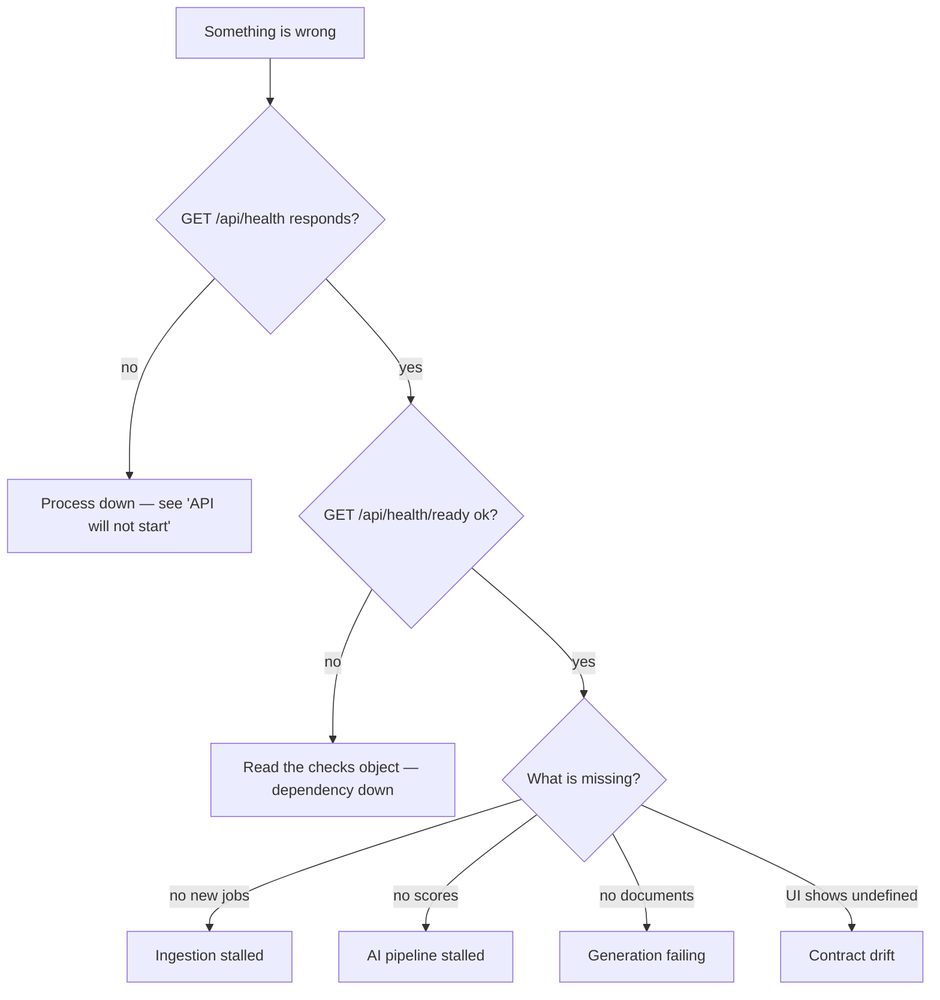
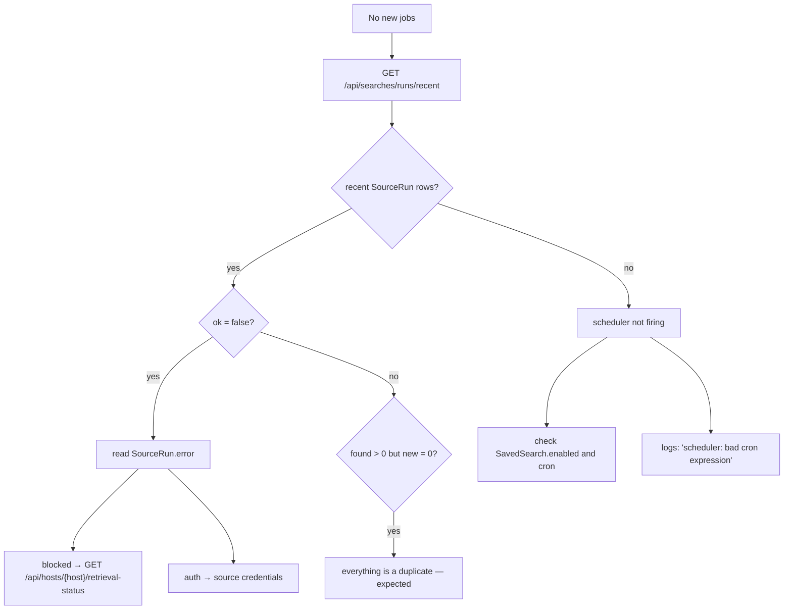
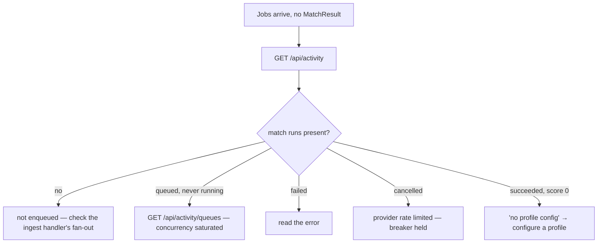
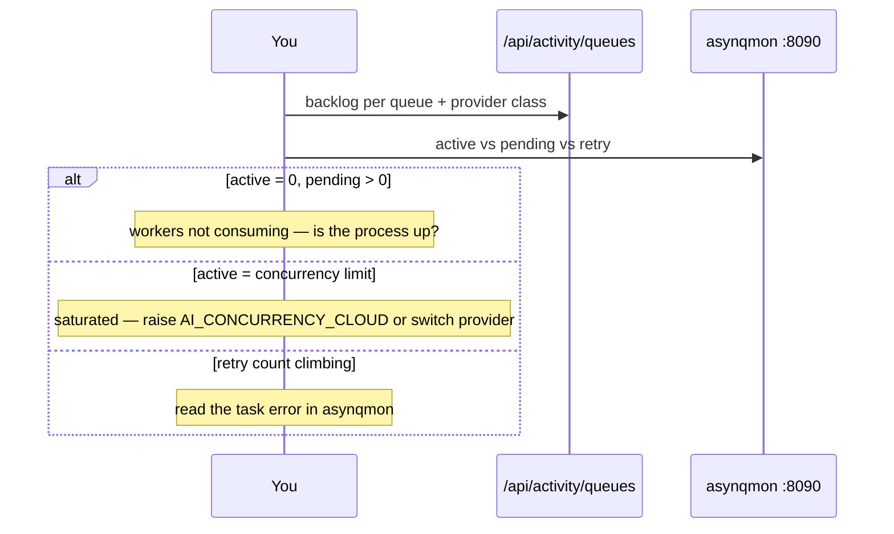
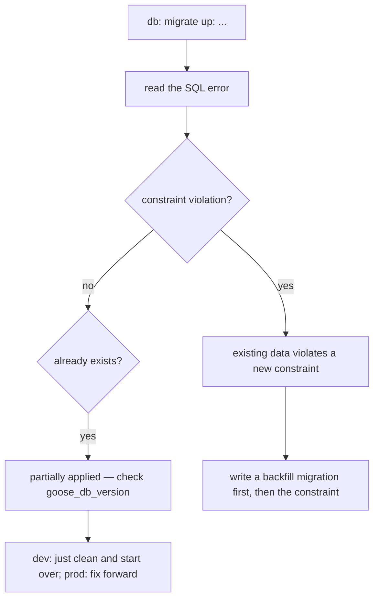
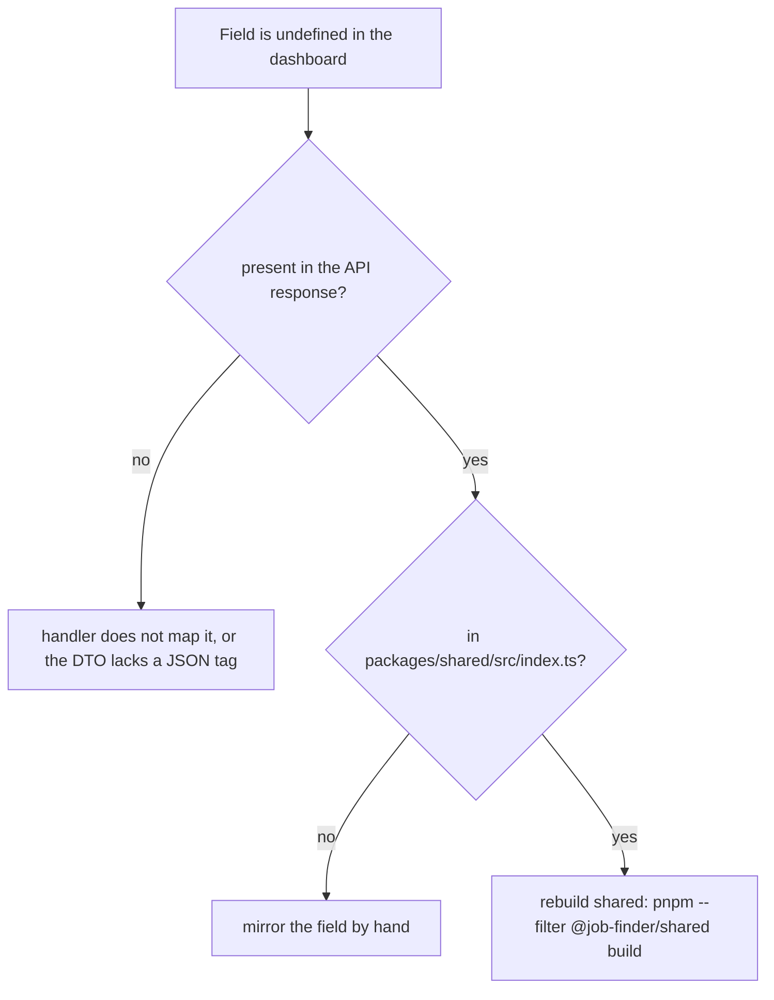

# Runbooks

## Triage entry point



## API will not start

**Symptoms.** Process exits immediately.

**Checks.**

```bash
just run-backend 2>&1 | head -20
```

| Message | Cause | Fix |
| --- | --- | --- |
| `DATABASE_URL is required` | missing env | set it in `.env` |
| `db: connect:` / `db: ping:` | Postgres unreachable | `just up`, check `POSTGRES_HOST_PORT` |
| `db: migrate up:` | migration failed | see the migration runbook below |
| `queue: <task>: local concurrency must be >= 1` | bad config | fix the concurrency variable |
| `queue: ACTIVITY_STALE_AFTER ...` | liveness bounds violated | stale ≥ 2 × heartbeat; stale + sweep < 5m |
| `queue: invalid REDIS_URL` | malformed URL | `redis://host:port/db` |

All of these are startup validation working as designed — the process refuses to run
misconfigured rather than misbehaving under load.

## Ingestion stalled — no new jobs



**Fixes.**

| Cause | Action |
| --- | --- |
| Search disabled or bad cron | fix it on the Sources page; `cron.ParseStandard` syntax |
| Host cooling off | `POST /api/hosts/{host}/override-cooling-off`, or wait |
| Host pinned to a broken rung | `POST /api/hosts/{host}/clear-rung-preference` |
| Stale session cookies | `POST /api/hosts/{host}/clear-cookies` |
| Credentialed source failing login | check `JOBLEADS_EMAIL` / `JOBLEADS_PASSWORD`; it can only use the direct rung |
| Adapter broken by a site change | run the source's live smoke test |
| Just slow | pacing is 0.7 rps per host by design |

## AI pipeline stalled — no scores



| Error | Meaning | Fix |
| --- | --- | --- |
| `llm: provider credential rejected` | bad key | fix the key, **restart** (credentials are env-only) |
| `llm: provider account out of credits` | quota | top up, or switch the task to Ollama |
| `llm: model unavailable` | unknown model id | fix the entry in `gateway/config.yaml`, then `docker compose restart litellm` |
| `llm: provider unavailable` | 5xx / transport | transient; check the provider |
| `llm: rate limited` | 429 | breaker holds up to 15 minutes; retry from the Status page |
| `queue: task exceeded its deadline` | slow model | raise `AI_TASK_TIMEOUT_MATCH` or route the task to a faster model |

:::note Work is running on Ollama when you expected a hosted provider
Every task chain terminates at Ollama by design, and entries whose credential is absent
are skipped silently. Check `docker compose logs litellm` for which upstream answered, and
confirm the provider key is present in the **`litellm` service's** environment — the Go
backend never reads provider keys. With `GATEWAY_URL` unset, everything runs on Ollama.
:::

## Queue backlog



Recovery actions: `POST /api/activity/retry`, `POST /api/activity/cancel-all`, or archive
in asynqmon.

## Runs stuck in `running`

**Cause.** The worker died without finalising its run.

**What happens automatically.** The sweeper marks it `interrupted` within
`ACTIVITY_STALE_AFTER + ACTIVITY_SWEEP_INTERVAL` — three minutes on defaults. It also
sweeps once at startup, so a restart cleans up the previous process's orphans.

**If it does not clear:** check the process is actually running, and that the sweeper
goroutine started (`runServers` launches it alongside the scheduler).

## Migration failure



Never edit an applied migration. Add a new one.

## Contract drift — UI shows `undefined`



Verify the wire directly:

```bash
curl -s localhost:3000/api/jobs | head -c 500
```

Remember: `tygo-check` guards `generated.ts`; **nothing** guards `index.ts`.

## Documents not generating

| Check | Action |
| --- | --- |
| `/api/activity` for `generate` runs | read the error |
| `rendercv` on PATH | `RENDERCV_BIN`; try it manually |
| `DOCUMENTS_DIR` writable | check permissions |
| MinIO configured but down | readiness shows it; either fix it or unset `MINIO_ENDPOINT` |
| Deadline exceeded | raise `AI_TASK_TIMEOUT_GENERATE` (default 15m) |

## Everything is slow

| Suspect | Check | Lever |
| --- | --- | --- |
| Local model | Ollama's own load | smaller model, or move the task to Cerebras |
| Hosted concurrency | `/api/activity/queues` | `AI_CONCURRENCY_CLOUD`, `LLM_MAX_IDLE_CONNS_PER_HOST` |
| Scraping pacing | by design at 0.7 rps/host | do not raise it for third-party hosts |
| Postgres | readiness latency figures | indexes exist on `Job(ingestedAt)`, `Job(status)`, `MatchResult(score)` |
| Feed rendering | thousands of rows | already virtualised |

## Redis flushed

Queued `ActivityRun` rows have no task behind them. The sweeper's queued pass confirms
absence via the asynq inspector and marks them `interrupted` after
`ACTIVITY_QUEUED_GRACE` (30 minutes). Re-run the affected searches; nothing in Postgres is
lost — Redis holds only in-flight work.

## Full reset (development)

```bash
just clean            # down -v, remove node_modules and dist
just up
pnpm install
pnpm --filter @job-finder/shared build
just run-backend      # migrates a fresh database
just seed             # optional sample data
```
