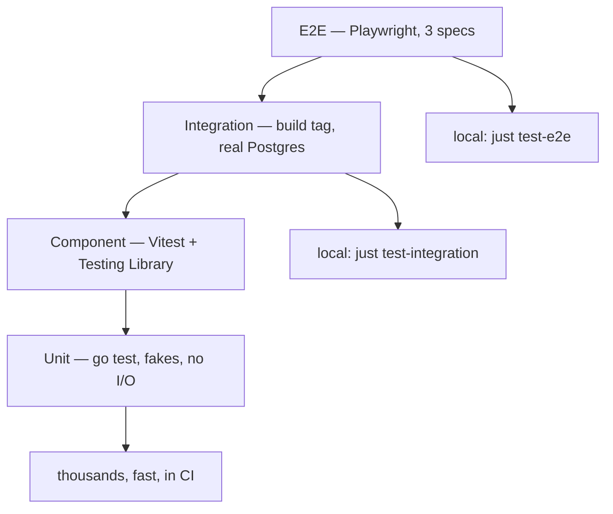
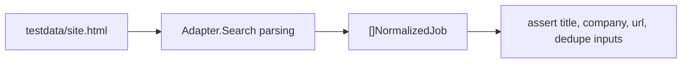
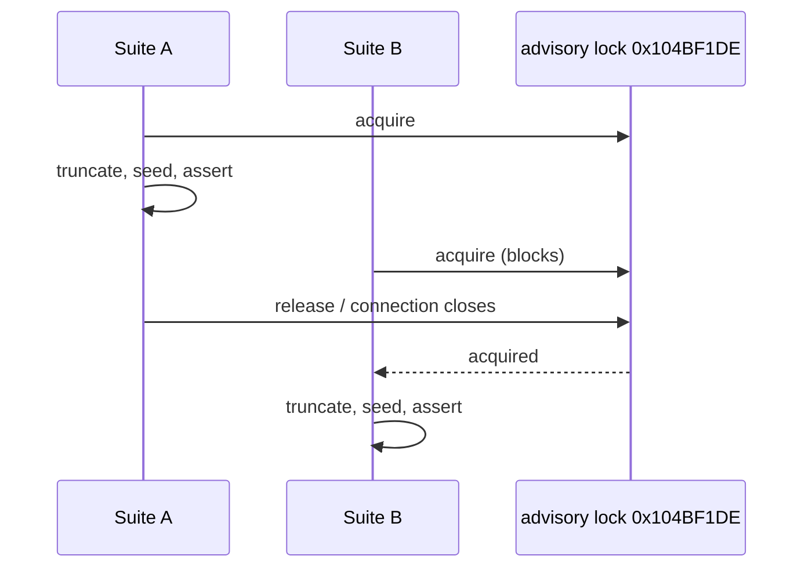
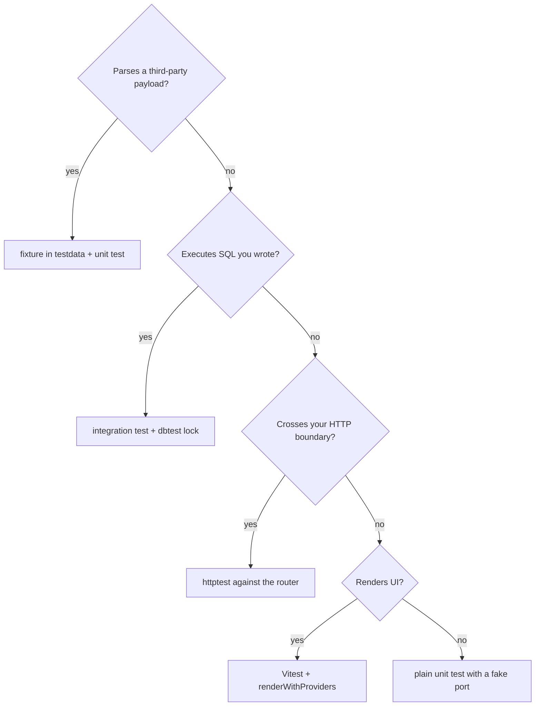

# Testing

## The pyramid



| Layer | Command | In CI |
| --- | --- | --- |
| Go unit | `just test-go` | yes (`go-test`) |
| Go vet | `go vet ./...` | yes (`go-vet`) |
| Go integration | `just test-integration` | yes (`integration-test`) |
| Frontend unit | `just test-react` | yes (`frontend-test`) |
| Typecheck | `pnpm typecheck` | yes (`frontend-typecheck`) |
| Codegen drift | `just sqlc-check`, `just tygo-check` | yes (`sqlc-drift`, `tygo-drift`) |
| E2E | `just test-e2e` | no |

## Go unit tests

Colocated `foo_test.go`, no external dependencies. Possible because services depend on
ports they declare themselves — a fake is a struct with the handful of methods the service
calls.

```bash
just test-go
# DATABASE_URL=...jobfinder_test REDIS_URL=redis://localhost:6379/1 go test ./...
```

The environment variables are set even for unit tests so a package that opportunistically
uses them points at the test database, never at development data.

### Fixture-based adapter tests

Every adapter under `internal/jobsources/adapters` has a `_test.go` and shares
`adapters/testdata`. Parser regressions are caught offline and deterministically; the
opt-in `adapters/live/live_test.go` is the tripwire for "the site changed its markup".



## Database-backed tests

```bash
just test-integration    # go test -tags integration ./...
```

Suites are behind `//go:build integration`, and `internal/dbtest` is compiled only under
that tag — it never links into the production binary.

No database has to exist first. `internal/testinfra` starts a `pgvector/pgvector:pg16`
container per test binary via [testcontainers](https://golang.testcontainers.org/), and
`internal/dbtest` clones a migrated template database out of it per suite, so a run needs a
Docker daemon and nothing else and can never read the dev stack's data. The same package
starts every other backing service a suite needs — RabbitMQ for `internal/events`, ClickHouse
for the Langfuse retention tests, MinIO for the blobstore, Redis for the cache client, LiteLLM
for the gateway config, headless Chrome for the browser and PDF paths, and FlareSolverr for
the retrieval ladder. Images match `docker-compose.yml` exactly, so a test runs what the stack
runs, and a suite fails rather than skips when a service cannot be started.

### What the containers made testable

| Suite | Was | Is |
| --- | --- | --- |
| `internal/db` migrations | only `goose up` ever ran | every `Down` block runs, rollback leaves an empty schema, and down-then-up rebuilds the identical one |
| `internal/events` AI account | `init-ai-user.sh` ran in compose and was trusted | the script itself runs against the broker; the account can read its four work queues, write results, and is refused ingest/enrich, work publishes and every declaration |
| `internal/platform/storage/.../minio` | one test: an unreachable endpoint errors | bucket creation, round trip, content type, overwrite, and where a missing key surfaces |
| `internal/queue` Redis | URL parsing only | the client connects, the `/1` database index is honoured, and credentials reach the server |
| `internal/scraping` browser | nothing — Chrome was a local binary | script-rendered content is read, the browser is reused across callers, and `Close` releases it |
| `internal/generation/infrastructure` | nothing — same reason | résumé and cover-letter PDFs are actually produced, deterministically, into a directory the renderer creates |
| `internal/aicontract` (new) | the Python consumer was stood in for by a Go fake | the real `apps/ai` container, as the restricted broker account, round-trips a ghost work event with every field decoded by each side's own types |
| `internal/retrieval` FlareSolverr | the library's client structs are unexported, so nothing could see the wire | the `request.get` contract holds, challenge-page rendering works, and the origin's status code is *not* reported — see below |

FlareSolverr's flat status code is worth knowing about: it drives a real browser, so `solution.status`
is always 200 and a 404 origin arrives as a successful solve whose body happens to be an error page.
Nothing downstream of that rung can tell a dead posting from a live one by status alone. The test
pins it, so if a future image starts reporting the real code the suite says so rather than the
behaviour changing silently.

### The gateway config

`internal/platform/llm/gateway_proxy_integration_test.go` runs the pinned LiteLLM image on the
real `gateway/config.yaml`, with both provider base URLs pointed at an in-test stub upstream.
No provider is contacted and no key is needed. It asserts what a YAML-level check cannot: that
the proxy accepts the file at all (a config it rejects never passes the liveliness wait), that
every scenario resolves to the tier the file declares, that `litellm_settings.fallbacks` still
fails over to the declared tier when the primary errors, that an unknown scenario name 4xxs
instead of finding a catch-all, and that `embed` requests the declared `output_dimension` —
the width the schema's vector columns are built on.

### The shared-database lock

`go test ./...` runs packages in parallel, and several suites `TRUNCATE` the same tables.
`dbtest.LockSharedDB` takes a session-level Postgres advisory lock so suites take turns.



A suite ending with `os.Exit` can ignore the release function — Postgres drops session
locks when the connection closes.

## Python tests

```bash
just test-py             # cd apps/ai && uv run pytest
```

`apps/ai/tests/integration/test_broker_contract.py` runs the service's real FastStream
consumers against a RabbitMQ container (`testcontainers[rabbitmq]`, same image as compose),
with the capability itself stubbed so no gateway is contacted. It proves the half of the
messaging contract the Go suite cannot see from its side: that the Python declarations and
`internal/events/topology.go`'s are compatible in either order, that a flat work message is
consumed and answered with a result the Go side can parse, that a classified failure is acked
and reported rather than redelivered forever, and that a raising handler dead-letters instead
of dropping the delivery. Like the Go suite, these fail rather than skip without Docker.

## Frontend tests

Vitest with jsdom, `src/test/setup.ts`, and `renderWithProviders` giving each test a fresh
`QueryClient` with `retry: false` and `gcTime: 0`. Details:
[frontend testing](/frontend/testing).

## E2E

```bash
just test-e2e
```

Recreates the test database, brings up compose, waits, then runs the three Playwright specs
(`navigation`, `feed`, `sources`) against the live stack.

## Live smoke tests

| File | Hits |
| --- | --- |
| `adapters/live/live_test.go` (job-scraper library) | real job boards |
| `internal/*/application/live_test.go` — ghostjob, recruiter, salary | the real chat provider |
| `internal/generation/**/`*`_live_test.go` | RenderCV, PDF rendering, eval corpus |
| `internal/generation/rendercv_live_test.go` | RenderCV in-process (no external binary needed) |
| `internal/generation/pdf_renderer_live_test.go` | real PDF rendering |
| `internal/retrieval/service_integration_test.go` | the real fetch ladder |

Opt-in and never run by CI. They exist so that when something breaks in the outside world,
it is diagnosable in one command.

## Choosing a test type



## Patterns worth copying

**Compile-time port conformance.**

```go
// internal/storage/minio_test.go
var _ Blobstore = (*MinioStore)(nil)
```

**Startup validation instead of a test.** `queue.PoliciesFromConfig` rejects invalid
concurrency and liveness settings at boot, so a whole class of misconfiguration cannot
reach a test at all.

**Cross-implementation fixtures.** `internal/crypto/crypto_test.go` carries a
`nodeFixture` produced by running the original Node implementation, proving the Go port
decrypts what the old system encrypted.

**Timeouts in tests that touch the network layer.**
`TestNewMinioStore_UnreachableEndpoint` uses a 3-second context to assert that an
unreachable endpoint errors rather than hangs.

## Debugging

```bash
cd apps/api && go test ./internal/matching/... -run TestX -v
cd apps/api && go test -race ./...
pnpm --filter @job-finder/dashboard test:watch
pnpm --filter @job-finder/dashboard test:coverage
```
