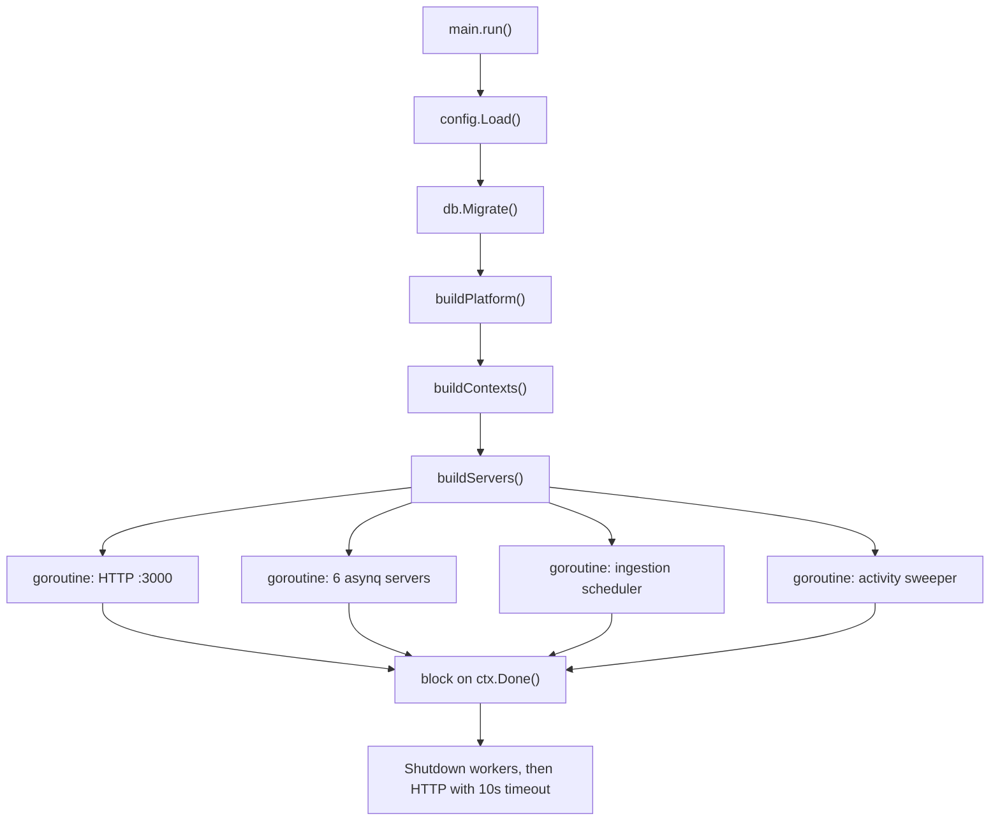
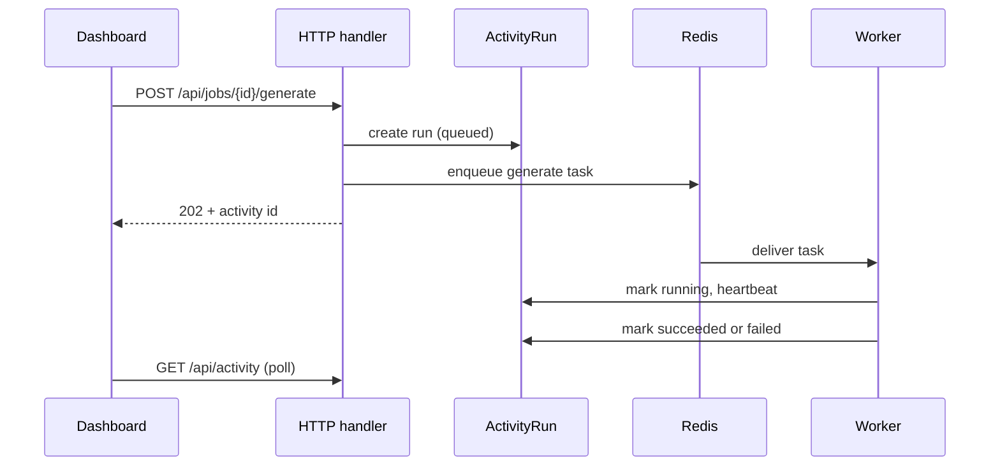
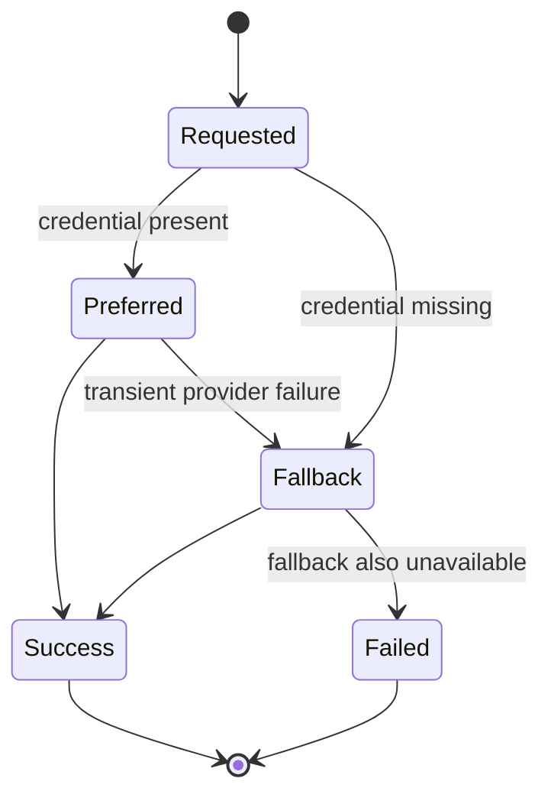
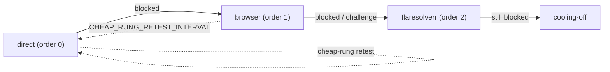

# Architectural principles

## 1. One process, many goroutines

**Rule.** The API server, all six workers, the ingestion scheduler and the activity
sweeper run as goroutines in a single binary.

**Why.** This is a self-hosted single-user product. Splitting it into services would buy
independent scaling nobody needs and cost an operator a deployment topology.

**Where.** `apps/api/cmd/server/servers.go:113-137`:

```go
go func() { servers.HTTP.ListenAndServe() }()
for _, w := range servers.Workers {
    go func() { w.srv.Run(w.mux) }()
}
go scheduler.Run(ctx)
go p.Sweeper.Run(ctx)
<-ctx.Done()
```



**When to break it.** If one worker class ever needs its own machine — for example a GPU
box for local inference — the same binary can be launched with a subset of workers. The
composition root already isolates each worker's construction.

## 2. Slow work is a task, never an HTTP request

**Rule.** Anything that scrapes, calls an LLM, or renders a PDF is enqueued. HTTP handlers
return an identifier and a status, not a result.

**Where.** Six task types, six dedicated queues, six asynq servers
(`internal/queue/queue.go:15-37`):

| Task type | Queue | LLM task key | Concurrency source |
| --- | --- | --- | --- |
| `ingest` | `ingest` | — | `INGEST_CONCURRENCY` |
| `match` | `match` | `match` | `AI_CONCURRENCY_LOCAL` / `AI_CONCURRENCY_CLOUD` |
| `generate` | `generate` | `generation` | `AI_CONCURRENCY_LOCAL` / `AI_CONCURRENCY_CLOUD` |
| `enrich` | `enrich` | — | `ENRICH_CONCURRENCY` |
| `salary:infer` | `salary:infer` | `default` | `AI_CONCURRENCY_LOCAL` / `AI_CONCURRENCY_CLOUD` |
| `ghost:score` | `ghost:score` | `ghost` | `AI_CONCURRENCY_LOCAL` / `AI_CONCURRENCY_CLOUD` |

The comment in `internal/queue/queue.go:22-37` states the reasoning precisely: a single
asynq server's `Queues` map is a *weighting*, not a ceiling, so each task type gets its own
server to obtain a hard per-type concurrency cap.



**When to break it.** Cheap, cached, deterministic reads — the keyword diff endpoint,
cached coach assessments — answer inline.

## 3. Degrade, never disappear

**Rule.** A missing credential, an unavailable provider or a failed optional data source
downgrades the feature; it never takes down the request path.

**Where.**

- `internal/llm/router.go:79-90` — a task set to Cerebras with no key configured silently
  resolves to Ollama. The HTTP layer surfaces `CredentialConfigured` so the operator can
  see *why*, but the task still runs.
- `apps/api/cmd/server/compose_features.go` (`composeSalary`) — with `LEVELS_FYI_CSV`
  unset the loader logs `salary: LEVELS_FYI_CSV not set — levels.fyi source disabled` and
  the service continues with its remaining sources.
- `internal/storage` — MinIO is optional; `MINIO_ENDPOINT` unset means local-disk
  documents, and `platform.MinioReady` stays `nil` so readiness skips the probe
  (`cmd/server/platform.go:100-110`).



**When to break it.** Data-integrity operations. A migration or an encrypted-config read
with a bad `CONFIG_ENCRYPTION_KEY` must fail loudly, not silently store plaintext.

## 4. Be a good web citizen

**Rule.** Scraping is paced by the target's own signals — crawl-delay and observed
behaviour — not by an arbitrary local quota, and escalation to heavier retrieval methods
is a last resort.

**Where.** `internal/retrieval/ladder.go:1-46` defines a three-rung ladder:



Two details encode the principle:

- `MaxRungForAccount(usesUserAccount bool)` caps a logged-in source at `direct`
  (`ladder.go:43-48`) — never drive a challenge-solver through someone's own account.
- Migration `00029_drop_host_budget.sql` deleted the per-host daily budget; pacing is now
  crawl-delay aware (see [Rate limiting](/ingestion/rate-limiting)).

**When to break it.** Never for third-party hosts. A locally hosted service you own is
fair game for aggressive concurrency.

## 5. Configuration is environment, secrets are encrypted at rest

**Rule.** All runtime configuration arrives as environment variables through
`internal/config`. Anything persisted that is secret is encrypted with
`CONFIG_ENCRYPTION_KEY`.

**Where.** `cmd/server/platform.go:78` constructs the retrieval state store with
`cfg.ConfigEncryptionKey`; `internal/crypto` holds the primitives. Full variable table:
[Configuration reference](/operations/configuration-reference).

## 6. The dashboard is a client, not a peer

**Rule.** The dashboard holds no business rules. Ranking, scoring, eligibility and
lifecycle transitions are computed server-side and shipped as DTOs.

**Where.** Every route in `apps/dashboard/src/app/routes.tsx` renders a feature page whose
data comes from `src/lib/api.ts`; the shared types come from `packages/shared`, which is
generated from the Go DTOs. See [Shared types](/frontend/shared-types).
