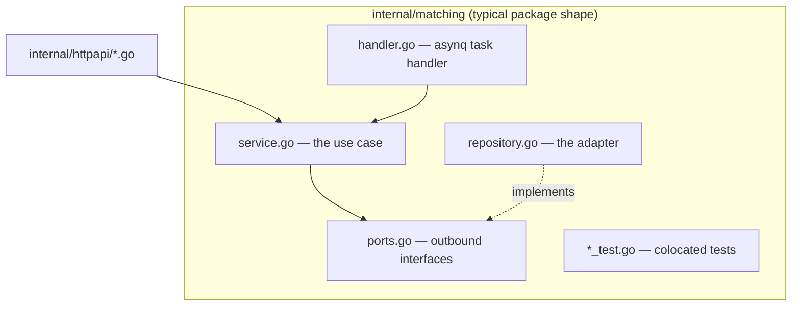
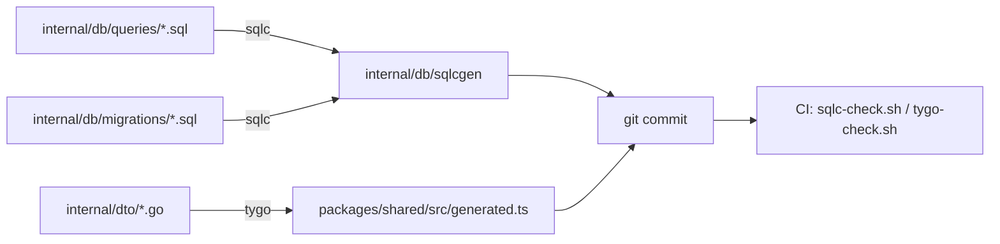
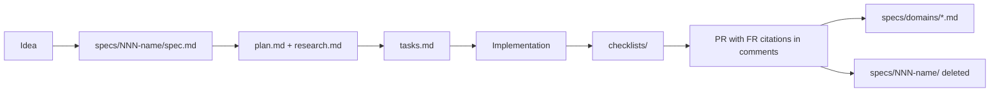

# Coding conventions

## Package layout

`apps/api/internal/<domain>` — one package per business capability, flat, named after the
thing rather than the layer. There is no `services/`, `handlers/`, `models/` split.



Recurring filenames and what they always mean:

| File | Meaning |
| --- | --- |
| `ports.go` | interfaces this package needs from the outside |
| `service.go` | the use case, no transport concerns |
| `handler.go` | an asynq task handler (`ProcessTask`) |
| `repository.go` | the persistence adapter |
| `<name>_test.go` | tests for `<name>.go`, same package |

## Comment style: comments explain *why*, and cite the spec

The prevailing style is a doc comment that records the decision, not the mechanics. From
`internal/queue/queue.go:22-37`:

> These are deliberately separate asynq *queues* … A single asynq.Server's `Queues` map
> only controls priority weighting *within* one shared worker pool, not a hard per-queue
> concurrency ceiling, so each task type still needs its own server.

Comments frequently cite the spec that produced the behaviour — `019-ai-job-throughput`,
`030-litellm-model-routing`, `FR-008`. Keep that habit: it is how the `specs/` tree stays
connected to the code. A cited feature number resolves through the registry in
`specs/README.md` to the domain doc that owns that rule today; note that a few cited
specs are **superseded** (`001-cerebras-model-toggle` by 030, `007-ci-test-gate` by 023),
so check the registry before treating a citation as current.

## Naming

- Exported constants for wire values are grouped and prefixed by kind: `TypeIngest`,
  `QueueIngest`, `RungDirect`, `TaskProviderOllama`.
- Sentinel errors are `Err<Condition>` and are compared with `errors.Is`, never by string.
- Payload structs are `<Task>Payload` with JSON tags in camelCase to match the TS side.
- Config fields carry `mapstructure:"UPPER_SNAKE"` tags matching the environment variable
  exactly (`internal/config/config.go`).

## Generated code is committed and never hand-edited



Rules:

1. Edit the `.sql` or the DTO, then run `just sqlc-generate` / `just tygo-generate`.
2. Commit the regenerated output in the same commit as its source.
3. Tool versions are pinned in `apps/api/.sqlc-version` and `apps/api/.tygo-version` so
   local and CI emit byte-identical code.
4. `packages/shared/src/index.ts` **re-exports and narrows** `generated.ts`; it never
   restates a shape. Only a nullability change touches it. Hand-written types with no Go
   counterpart live in `consumer-only.ts`. Reintroducing a hand-maintained duplicate of a
   generated shape is caught by the `shared-types-no-duplicates` CI job.

## Adding an HTTP handler

Handlers live in their own feature's `interfaces/http/` package and expose a
`Mount(r chi.Router)` method, registered as variadic mounts in `buildServers`
(`cmd/server/servers.go`) — never by editing `router.go`. `internal/httpapi` holds the
router and its middleware only, and depends on zero feature modules; the `depguard` rules
in `.golangci.yml` and `internal/arch_test.go` enforce both halves.

```go
// internal/jobsources/interfaces/http/hosts.go
func (h *HostsHandler) Mount(r chi.Router) {
    r.Get("/hosts/{host}/retrieval-status", h.retrievalStatus)
    r.Post("/hosts/{host}/clear-cookies", h.clearCookies)
}
```

`NewRouter` mounts every handler under both `/api` and `/api/v1`
(`internal/httpapi/router.go:38-39`), so paths inside a `Mount` must **not** carry a
version prefix of their own.

## The spec-driven workflow



In-flight feature directories are numbered (`specs/<nnn>-<slug>/`) and carry `spec.md`,
`plan.md`, `tasks.md`, plus `checklists/` and `contracts/` where relevant. On merge the
requirements and contracts fold into `specs/domains/` and the feature directory is deleted
outright — there is no archive, so exactly one copy of every binding rule exists. Tooling
lives in `.specify/`; the registry is `specs/README.md`.

## Commits

From `AGENTS.md`: conventional commits (`feat:`, `fix:`, `chore:`, `docs:`), created after
a completed feature or refactor, containing only files you changed.

## Frontend conventions

- Feature-sliced: `apps/dashboard/src/features/<slice>` owns its pages and components.
- All server access goes through `src/lib/api.ts`; query keys are centralised in
  `src/lib/queryKeys.ts`.
- Shared primitives live in `src/components/ui.tsx`; layout in `src/components/layout`.
- Types come from `@job-finder/shared`, never redeclared locally.
