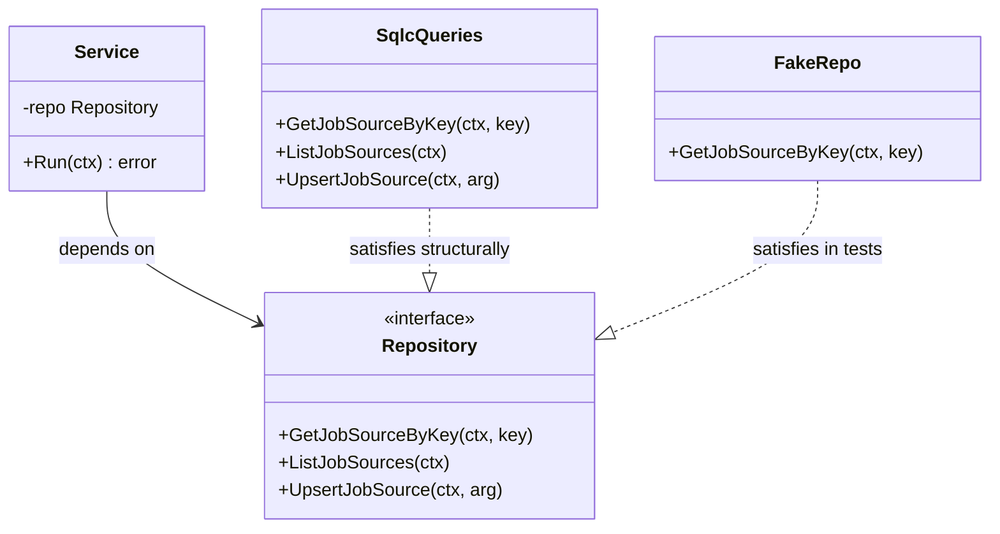
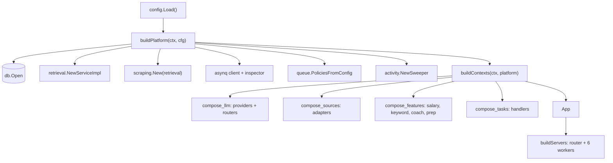
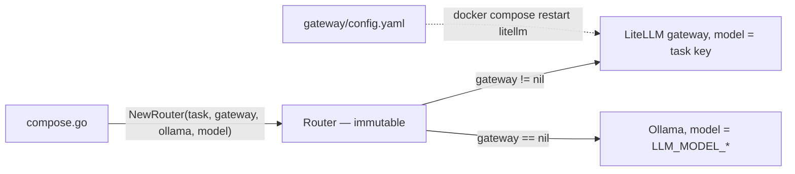

# Dependency injection

## Rule: no framework, no globals, no service locator

Every dependency is a constructor argument. There is no DI container, no `init()`-time
registry, and no package-level mutable singleton in the service packages.

```go
// apps/api/cmd/server/compose_features.go
salaryService := salary.NewService(p.DB.Queries, defaultRouter, levelsFyiLoader, "")
```

The consequence you feel daily: a test constructs the same service with fakes and no
build tags, environment, or reset hooks.

## Rule: the consumer declares the port

An outbound dependency is an interface **in the consuming package**, not in the
implementing one.



`internal/jobsources/ports.go` is the model: the interface names exactly the six queries
the service uses, and `*sqlcgen.Queries` satisfies it without importing anything from
`jobsources`. The same `ports.go` convention appears in `internal/ingestion`,
`internal/matching` and elsewhere.

:::tip Interface size
Ports list the methods the consumer calls — not the full repository surface. A port with
six methods is a six-method fake in tests, not a hundred-method one.
:::

## Rule: all wiring lives in the composition root

`apps/api/cmd/server/` is the only package that knows how the whole system fits together.
It is split by concern rather than being one giant file:

| File | Responsibility |
| --- | --- |
| `main.go` | load config, migrate, build, run, shut down |
| `platform.go` | process-wide infrastructure: DB, Redis, asynq, retrieval, MinIO probe, policies, sweeper |
| `compose.go` | top-level `buildContexts`, assembling the `App` |
| `compose_llm.go` | providers, snapshot holder, per-task routers |
| `compose_sources.go` | job-source adapters and the registry |
| `compose_features.go` | enrichment, salary, keyword, coach, interview prep |
| `compose_intel.go` | company intel and related services |
| `compose_tasks.go` | task handlers |
| `compose_support.go` | supporting handlers |
| `compose_types.go` | the `App` struct and handle types |
| `servers.go` | HTTP server, six asynq workers, run/shutdown orchestration |



## Rule: lifecycles are owned by the caller that created them

`buildPlatform` returns resources; `run()` closes them, in `main.go:45-49`:

```go
defer platform.DB.Close()
defer platform.Scraping.Close()
defer platform.AsynqClient.Close()
defer platform.AsynqInspector.Close()
```

Services never close what they did not open. The rule is stated in the doc comment on
`buildPlatform`: *"Callers own the lifecycle."*

## Rule: shared mutable state is explicit and atomic

The one deliberate exception to "no shared state" is typed and documented:

- **`adapters.JobLeadsSession`** is shared *by pointer* between the adapter registry and
  the enrichment handler (`cmd/server/platform.go`), because a login session is genuinely
  one shared thing.

The LLM router used to be a second exception: an `llm.SnapshotHolder` wrapping an
`atomic.Value`, restored on every `Router.resolve()` so a Settings change took effect
without a restart. Feature `030-litellm-model-routing` deleted it. `application.Router` is
now **static and fixed at construction** — the task key, the gateway provider, the local
provider and the local model are all set once in `cmd/server/compose.go` and never change
for the process's lifetime.



Routing is reconfigured by editing `gateway/config.yaml` and restarting one container —
not by mutating process state. The atomic snapshot is gone because there is no longer any
runtime-mutable routing state to hold.

## Rule: runtime policy is validated at startup

`queue.PoliciesFromConfig(cfg)` builds and validates every task policy before any worker
starts (`internal/queue/policy.go:40-100`), rejecting concurrency below 1, non-positive
durations, and liveness settings that violate the sweeper's bounds. A misconfigured
process fails at boot with a precise message rather than misbehaving under load.

## When to break these rules

- A pure helper with no I/O needs no port. Do not create an interface for `strutil`.
- Cross-cutting infrastructure that every package needs (`slog` default logger) is
  allowed to be ambient.
