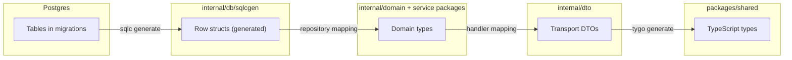
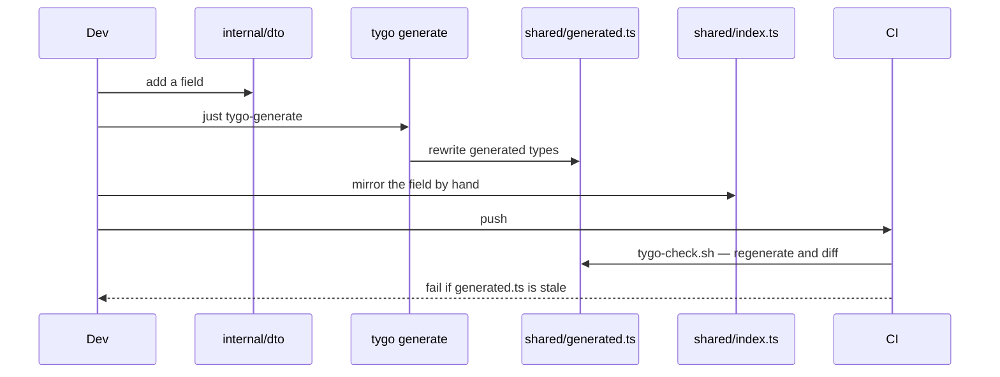
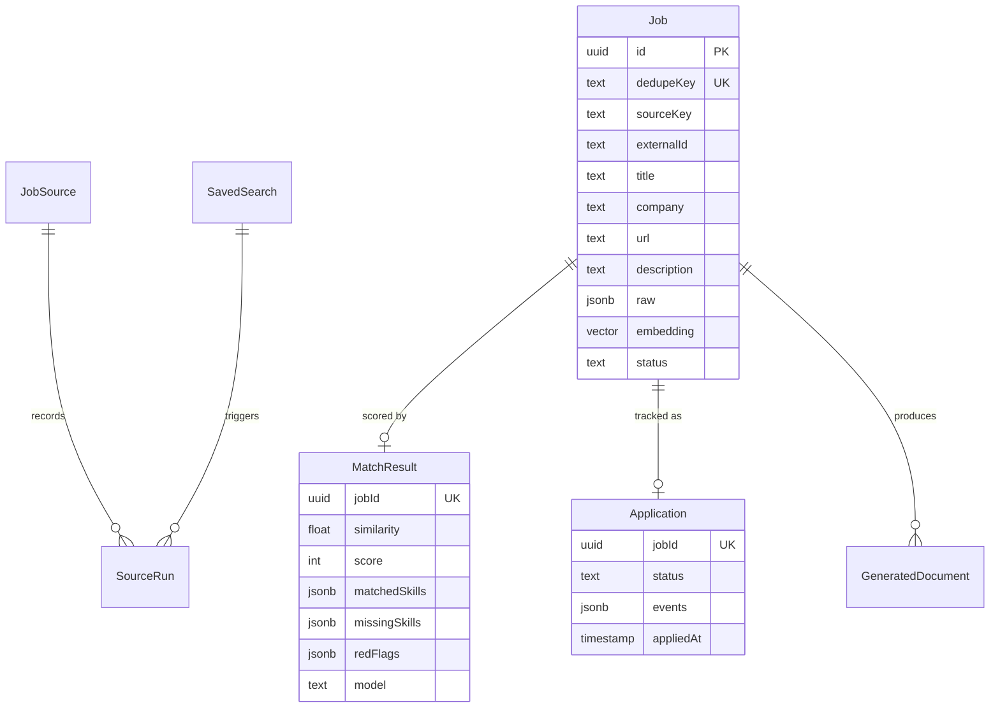
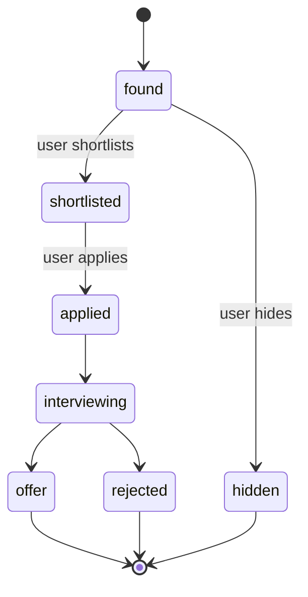

# Domain modeling

## Three layers, three owners



| Layer | Owner | Generated? | May change freely? |
| --- | --- | --- | --- |
| Table | `internal/db/migrations/*.sql` | no | append-only migration |
| Row struct | `internal/db/sqlcgen` | **yes**, by sqlc | never edit by hand |
| Domain type | `internal/domain`, service packages | no | yes, internal |
| DTO | `internal/dto` | no | breaking change for the UI |
| TS type | `packages/shared/src/generated.ts` | **yes**, by tygo | never edit by hand |

## Rule: generated types never leak upward past the repository

A service package depends on a **port** it declares itself, not on `sqlcgen`. The
canonical example is `internal/jobsources/ports.go:8-18`:

```go
type Repository interface {
    GetJobSourceByKey(ctx context.Context, key string) (sqlcgen.JobSource, error)
    ListJobSources(ctx context.Context) ([]sqlcgen.JobSource, error)
    SetJobSourceConfig(ctx context.Context, arg sqlcgen.SetJobSourceConfigParams) error
    SetJobSourceEnabled(ctx context.Context, arg sqlcgen.SetJobSourceEnabledParams) error
    SetJobSourceHealthy(ctx context.Context, arg sqlcgen.SetJobSourceHealthyParams) error
    UpsertJobSource(ctx context.Context, arg sqlcgen.UpsertJobSourceParams) error
}
```

`*sqlcgen.Queries` satisfies it *structurally* — the service never imports the concrete
type, so tests substitute a fake with no database.

:::note Pragmatism
Some ports still name `sqlcgen` row types in their signatures, as above. The rule that is
actually enforced is **the direction of the dependency**: the service owns the interface,
so swapping the storage implementation is a local change.
:::

## Rule: the DTO is the contract, and it is duplicated on purpose

`AGENTS.md` states it directly: Go DTO field names and JSON tags in `internal/dto` must
match `packages/shared/src/index.ts` field-for-field, because `index.ts` is
hand-maintained and does **not** re-export the tygo-generated `generated.ts`.



The failure mode this prevents: a Go field renamed, JSON silently changing shape, and a
dashboard that renders `undefined` with no type error anywhere.

## Rule: identity is a dedupe key, not a URL

A `Job` is identified by `dedupeKey`, which carries a `UNIQUE` constraint
(`00001_init.sql:31-48`). `externalId` is nullable because not every source exposes one,
and `url` is not unique because the same posting is reachable through several URLs.



## Rule: keep the raw payload

Every ingested job stores its provider payload in `raw jsonb NOT NULL`
(`00001_init.sql:41`). Normalization is lossy and adapters change; keeping `raw` means a
parser bug can be re-run over history instead of requiring a re-scrape.

## Rule: state is a string column with an explicit vocabulary

`Job.status` defaults to `'found'`, `Application.status` to `'shortlisted'`. Lifecycle
transitions live in Go, not in database constraints, so a new state is a code change plus
a backfill rather than a type migration.


