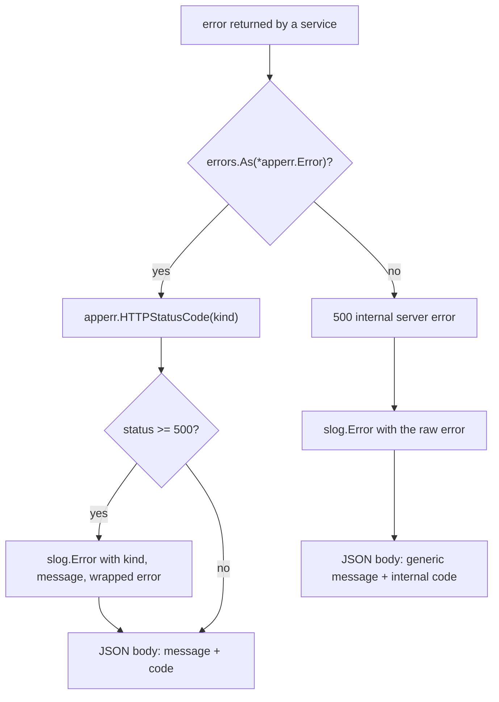
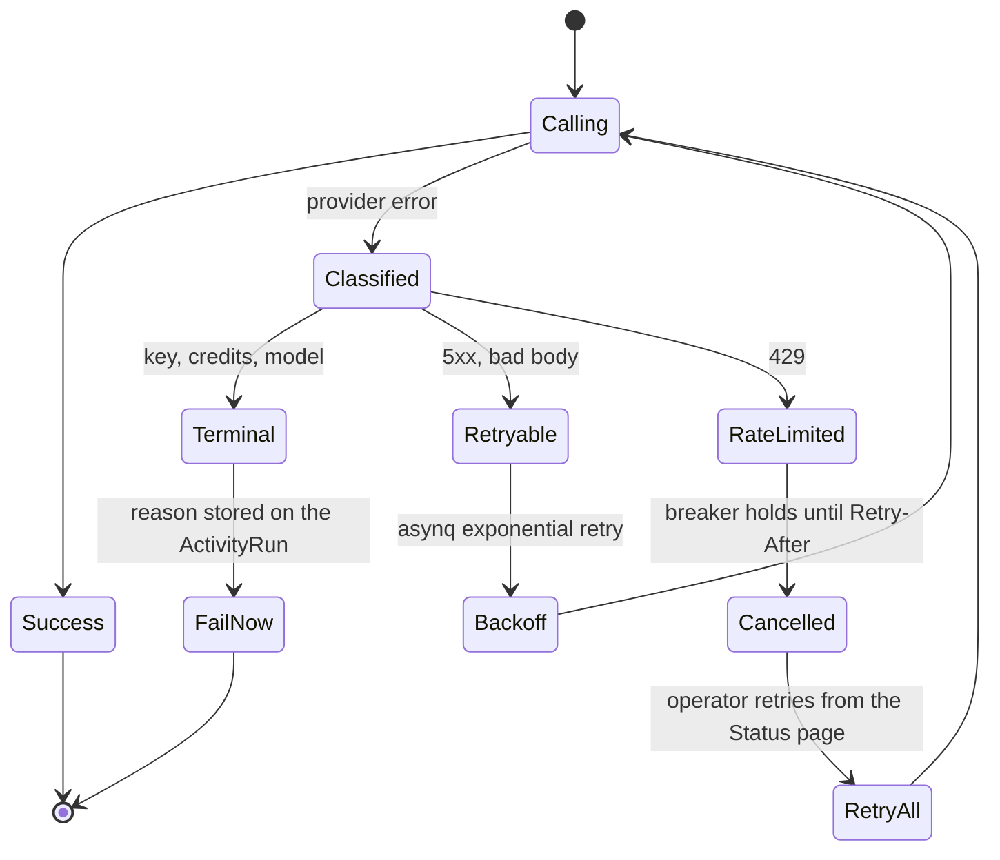
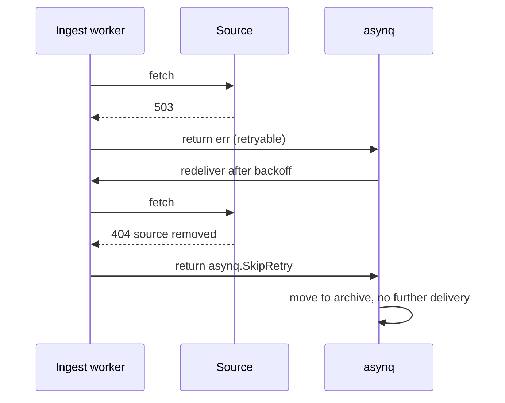

# Error handling

## Rule: errors are typed values, mapped to transport exactly once

`internal/apperr` defines a small closed set of kinds and a single mapping function.
Handlers never choose a status code themselves.

```go
// internal/apperr/apperr.go
const (
    KindNotFound        Kind = "not_found"
    KindValidation      Kind = "validation"
    KindConflict        Kind = "conflict"
    KindUnauthorized    Kind = "unauthorized"
    KindForbidden       Kind = "forbidden"
    KindPrecondition    Kind = "precondition_failed"
    KindTooManyRequests Kind = "too_many_requests"
    KindInternal        Kind = "internal"
)
```

The mapping happens in `internal/httpapi/helpers.go:36-49`, in `writeAppError`:



Two properties follow:

1. **The client always gets a machine-readable `code`.** `ErrorResponse.Code` is the
   `apperr.Kind` (`helpers.go:12-16`), so the dashboard branches on a stable string, not
   on a status number or a message.
2. **Unclassified errors never leak internals.** The fallback path returns
   `"internal server error"` and logs the real error server-side.

| Kind | HTTP | Typical producer |
| --- | --- | --- |
| `not_found` | 404 | `apperr.NotFound("job", id)` |
| `validation` | 400 | request body / query parsing |
| `conflict` | 409 | duplicate key, concurrent edit |
| `unauthorized` | 401 | missing source credential |
| `forbidden` | 403 | disabled feature |
| `precondition_failed` | 412 | e.g. no profile configured |
| `too_many_requests` | 429 | source or provider rate limit |
| `internal` | 500 | everything unclassified |

:::tip Wrapping preserves the chain
`apperr.Wrap(kind, message, err)` keeps the cause reachable via `Unwrap()`
(`apperr.go:31-45`), so `errors.Is` still works against sentinel errors deeper in the
stack while the outer kind decides the status.
:::

## Rule: provider failures are classified, not blindly retried

`internal/llm/errors.go:26-57` defines a six-error taxonomy and two predicates.

| Sentinel | Meaning | `Terminal` | `Retryable` | Handler action |
| --- | --- | --- | --- | --- |
| `ErrRateLimited` | quota exhausted, breaker tripped | no | **no** | cancel the task |
| `ErrCredentialRejected` | bad or revoked key | **yes** | no | fail immediately |
| `ErrInsufficientCredits` | account out of credit | **yes** | no | fail immediately |
| `ErrModelUnavailable` | unknown/withdrawn model | **yes** | no | fail immediately |
| `ErrProviderUnavailable` | 5xx or transport failure | no | **yes** | let asynq retry |
| `ErrInvalidResponse` | 2xx with unexpected body | no | **yes** | let asynq retry |



The rationale is written into the code comment at `errors.go:50-57`: rate limiting is
deliberately **not** retryable, because the per-provider circuit breaker already holds the
whole process off and re-queuing would burn requests against an exhausted quota.

## Rule: only transient failures consume retries

Ingest tasks run with `IngestMaxRetry = 2` — three deliveries total
(`internal/queue/queue.go:39-49`). The comment explains the trade-off: scraping is the
least reliable step and runs are hours apart, so one 503 used to cost a source its entire
cron window. Errors that a retry cannot fix are wrapped in `asynq.SkipRetry` by the
handler (`ingestion.permanent`), so the retry budget is only ever spent on transient
faults.



## Rule: log where you have context, return where you have the decision

`writeError` and `writeAppError` log only at 5xx (`helpers.go:29-34`, `39-42`). Services
return errors upward rather than logging them; the composition root and the HTTP edge
decide what is worth an operator's attention. Optional-feature degradation logs at `warn`
at the point of degradation — for example the levels.fyi loader in
`cmd/server/compose_features.go`.

## Anti-patterns this codebase avoids

- `panic` in request paths. The one deliberate `panic` is a startup invariant:
  `Platform.policyFor` panics if a wired task type has no `TaskPolicy`
  (`cmd/server/servers.go:56-63`) — a programmer error that must never reach production.
- Bare `error` strings compared by text. Classification is by sentinel and `errors.Is`.
- Status codes chosen per handler. There is exactly one mapping table.
