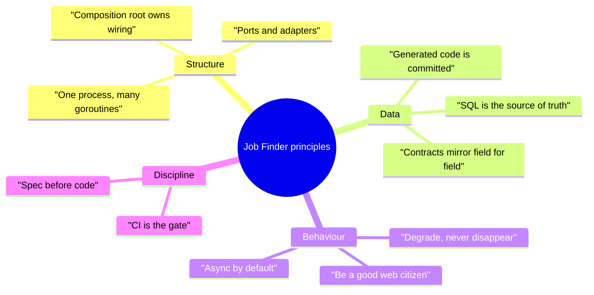
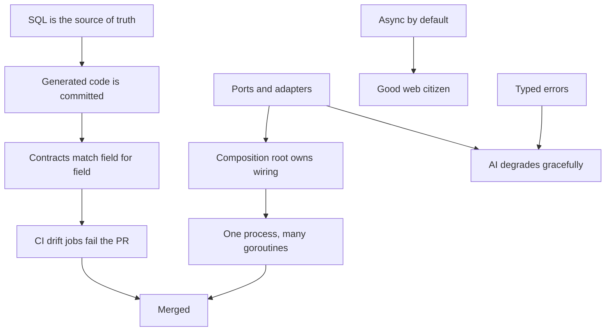

# Principles overview

This section states the rules the codebase plays by. Each principle is written as
*rule → why → where it shows up → when to break it*. Nothing here is aspirational: every
rule is one you can verify by reading the file it cites.

## The ten rules

| # | Principle | Enforced in | Detail |
| --- | --- | --- | --- |
| 1 | One process, many goroutines | `cmd/server/main.go:41-56` | [Architectural](/principles/architectural-principles) |
| 2 | The composition root owns all wiring | `cmd/server/compose*.go` | [DI](/principles/dependency-injection) |
| 3 | Ports and adapters at every I/O edge | `internal/*/ports.go` | [DI](/principles/dependency-injection) |
| 4 | SQL is the source of truth; sqlc generates the access layer | `internal/db/queries/*.sql` | [Domain modeling](/principles/domain-modeling) |
| 5 | Generated code is committed and drift-checked | `scripts/sqlc-check.sh`, `scripts/tygo-check.sh` | [Coding conventions](/principles/coding-conventions) |
| 6 | Go DTOs and TypeScript types match field-for-field | `internal/dto`, `packages/shared/src/index.ts` | [Domain modeling](/principles/domain-modeling) |
| 7 | Every AI feature degrades gracefully | `internal/llm/router.go:79-90` | [Architectural](/principles/architectural-principles) |
| 8 | Slow work is a task, never an HTTP request | `internal/queue/queue.go:15-20` | [Architectural](/principles/architectural-principles) |
| 9 | Be a good web citizen when scraping | `internal/retrieval/*` | [Architectural](/principles/architectural-principles) |
| 10 | Errors are typed values mapped once at the edge | `internal/apperr` | [Error handling](/principles/error-handling) |

## How the principles reinforce each other

The chain matters: because the schema generates the Go types, and the Go DTOs generate
the TypeScript types, a schema change that nobody propagated **cannot** reach `master` —
`sqlc-drift` and `tygo-drift` in `.github/workflows/api-ci.yml` fail first.

## Pages in this section

- [Architectural principles](/principles/architectural-principles) — process shape, async, degradation, scraping ethics
- [Domain modeling](/principles/domain-modeling) — three type layers and the rules for crossing them
- [Error handling](/principles/error-handling) — `apperr` kinds, retryable vs terminal, HTTP mapping
- [Dependency injection](/principles/dependency-injection) — constructor injection, ports, the composition root
- [Testing philosophy](/principles/testing-philosophy) — what is unit, what needs Postgres, what is a live smoke test
- [Coding conventions](/principles/coding-conventions) — naming, file layout, generated code, comments
