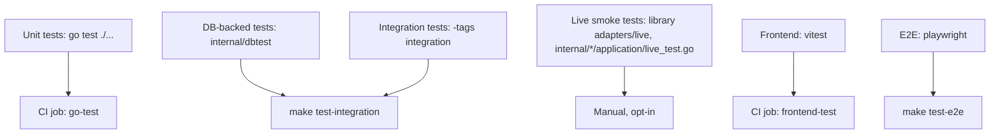
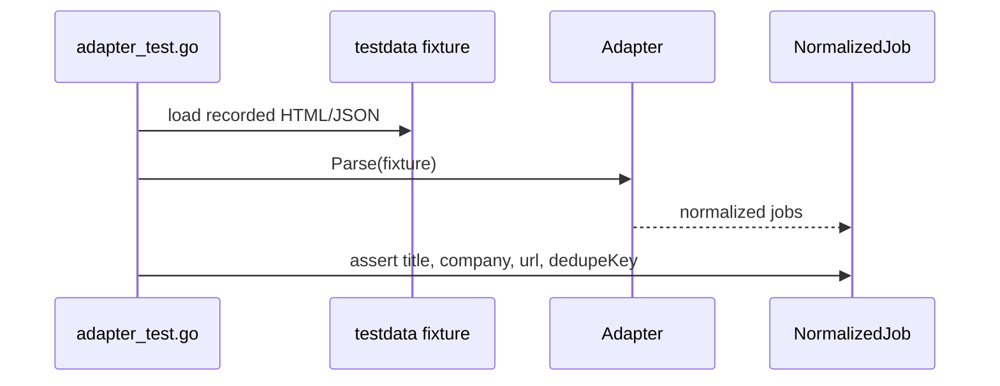
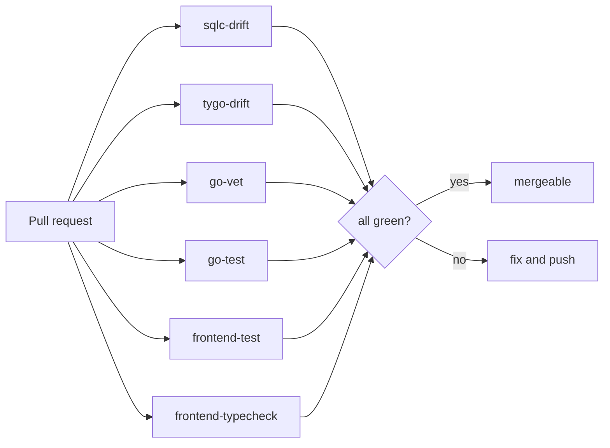
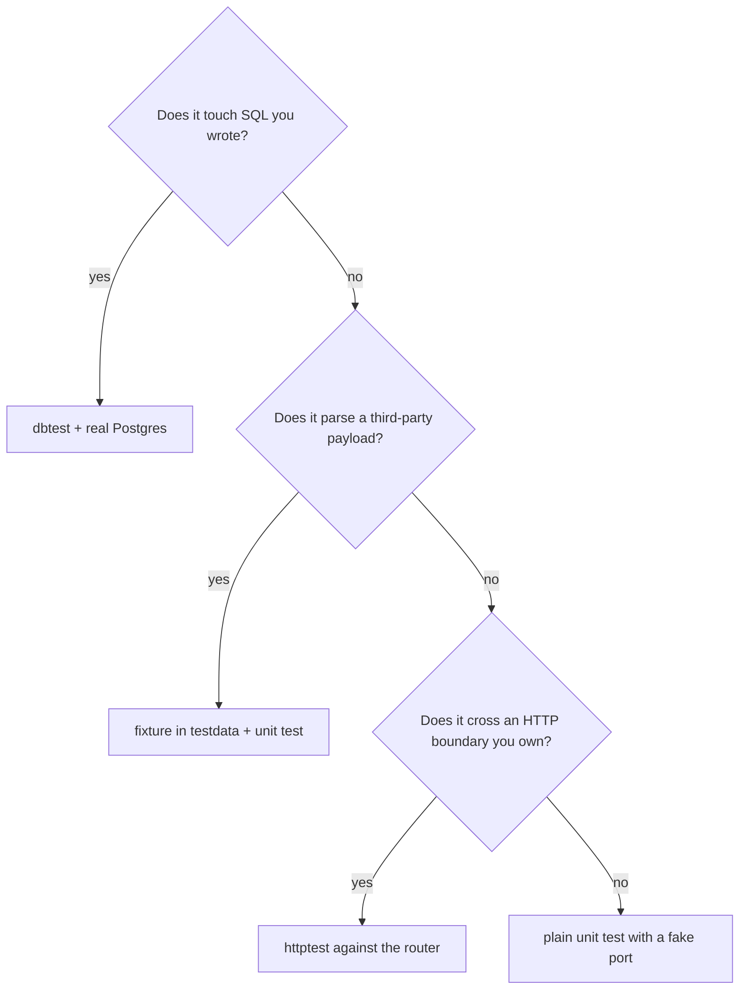

# Testing philosophy

## Rule: the default test needs nothing but Go

Tests live next to the code (`foo.go` / `foo_test.go`) and the vast majority run with
plain `go test ./...` — no database, no Redis, no network. That is possible only because
services depend on ports they declared themselves
([DI](/principles/dependency-injection)), so a fake is a struct with the six methods the
service actually calls.

## The layers

| Layer | Location | Needs | Run by |
| --- | --- | --- | --- |
| Unit | `internal/**/ *_test.go` | nothing | `make test-go`, CI `go-test` |
| Repository / DB | helpers in `internal/dbtest` | a Docker daemon (Postgres container) | `make test-integration` |
| Integration | files behind `//go:build integration` | a Docker daemon (Postgres, RabbitMQ, ClickHouse, LiteLLM containers) | `make test-integration` |
| Live smoke | `adapters/live/live_test.go` (library), `internal/*/application/live_test.go` | real network + credentials | manual |
| Frontend unit | `apps/dashboard/**/*.test.ts(x)` | jsdom | `make test-react`, CI `frontend-test` |
| E2E | `apps/dashboard/tests` (Playwright) | full stack up | `make test-e2e` |

:::warning Live tests are opt-in on purpose
The library's `adapters/live/live_test.go` hits real job boards. It exists so an adapter break is diagnosable,
not to run on every commit — CI never executes it.
:::

## Rule: adapters are tested against captured fixtures

Every adapter under `internal/jobsources/adapters` has a sibling `_test.go`, and the
package carries a `testdata/` directory of recorded responses. A parser regression is
caught deterministically and offline; the live test is only the tripwire for "the site
changed its HTML".

## Rule: test the boundary you own

- **HTTP handlers** are tested through the router with `httptest` — see
  `internal/*/interfaces/http/*_test.go` (for example `jobsources/interfaces/http/sources_test.go`) —
  so route wiring, decoding and status mapping are covered together.
- **Policies and middleware** get table tests: `internal/queue/policy_test.go` asserts
  that invalid concurrency and liveness settings are rejected at startup.
- **Routing logic** gets its own test: `internal/llm/router_test.go` covers the
  fallback-to-Ollama path when a credential is absent.

## Rule: startup validation is a test you get for free

Because `PoliciesFromConfig` validates at boot (`internal/queue/policy.go:96-120`), a bad
`AI_CONCURRENCY_LOCAL` fails immediately with a named message rather than producing a
subtly wrong worker pool. Prefer moving a class of bug into startup validation over
writing a test that asserts the buggy behaviour is absent.

## Rule: CI is the gate, and it gates generated code too

`.github/workflows/api-ci.yml` runs six independent jobs on every PR:

`sqlc-drift` and `tygo-drift` re-run the generators with the pinned versions from
`apps/api/.sqlc-version` / `.tygo-version` and diff the result. Forgetting
`make sqlc-generate` is a red build, not a mystery at runtime.

## Writing a new test — the decision

